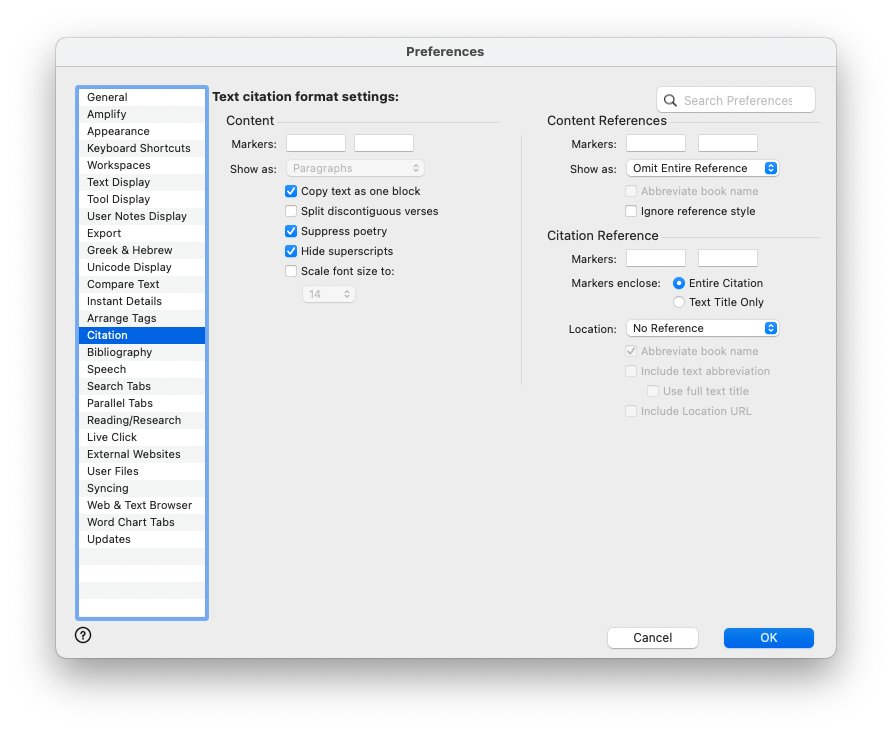
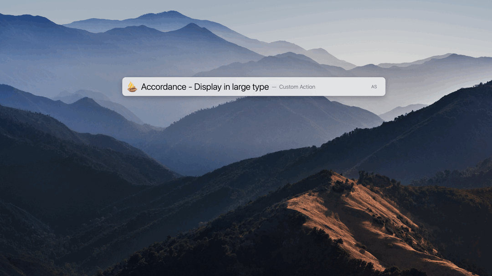
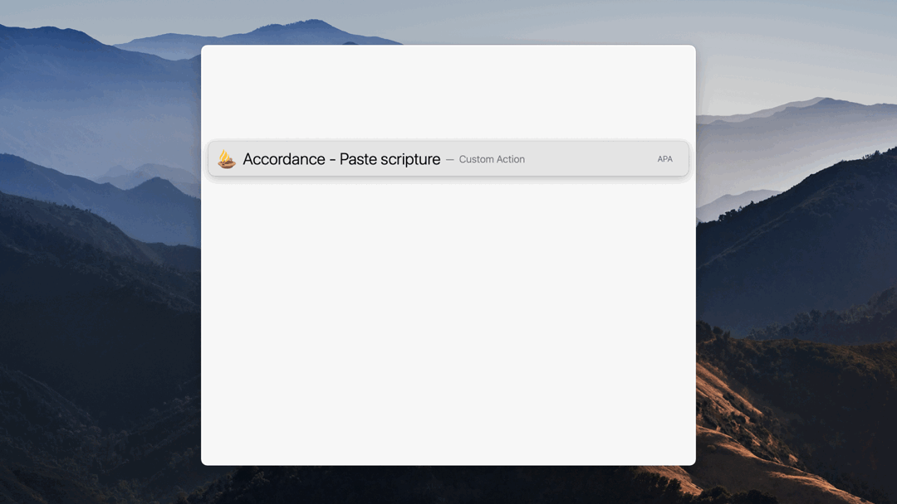
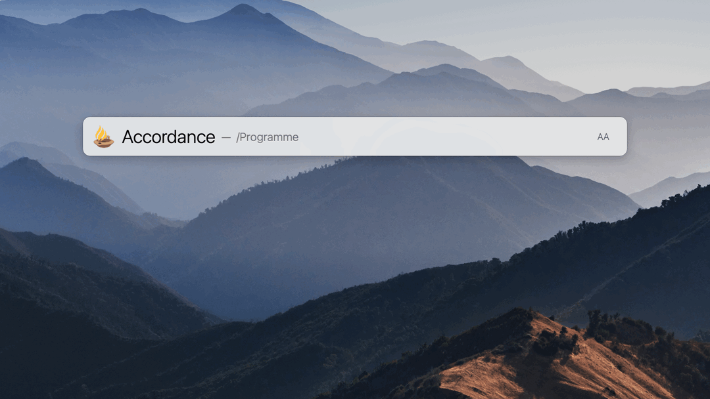
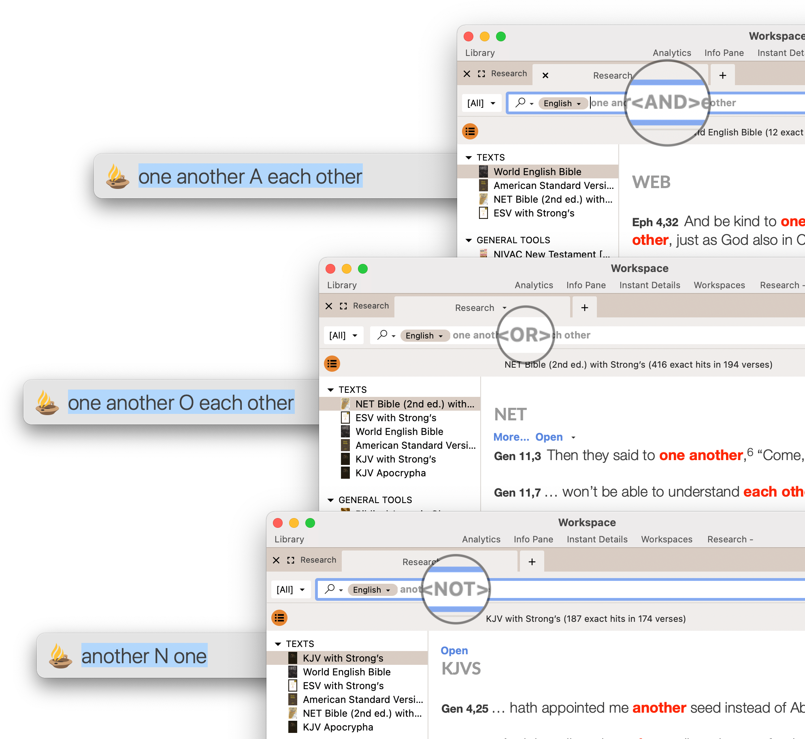

# LaunchBar Browser Actions
These actions require [Accordance Bible Software](https://www.accordancebible.com/). There is also a post related to these in the [Accordance Forums](https://forums.accordancebible.com/topic/5191-launchbar-scripts/). The original AppleScripts/Automator Workflows were developed by [Joe Weaks](http://macbiblioblog.blogspot.com/search/label/accordance).

In order to make display and paste actions work properly it is suggested to set up citation settings like this in Accordcance: 

## Display in large type 

Options: `⇧⏎` = Set default translation, `⌘⏎` (after entry) = Choose translation

## Paste scripture

Options: `⇧⏎` = Settings, `⌘⏎` (after entry) = Choose translation

## Look up scripture 

Options: `⌘⏎` (after entry) = Choose translation

## Search words

Per default spaces are replaced with "AND" tags. Alternatively you can use quotation marks to search for an exact term, or you can fine-tune your search by using "A" (AND), "O" (OR) or "N" (NOT) as shown here:    

**Advanced**: With "#" you can scroll to a specific book. For example "Moses#Acts_6:14" will return all verses with "Moses", but scroll to Acts 6:14. 
You can also choose a specific translation from a list if you press `⌘⏎` after entering your query. 

## Download
[Download LaunchBar Accordance Actions](https://minhaskamal.github.io/DownGit/#/home?url=https://github.com/Ptujec/LaunchBar/tree/master/Accordance-Actions) (powered by [DownGit](https://github.com/MinhasKamal/DownGit))

## Updates

The latest versions of these actions integrate with Action Updates by @prenagha. You can find the [latest version of Action Updates in his Github repository](https://github.com/prenagha/launchbar). For more information and a signed version of Action Updates [visit his website](https://renaghan.com/launchbar/action-updates/).
