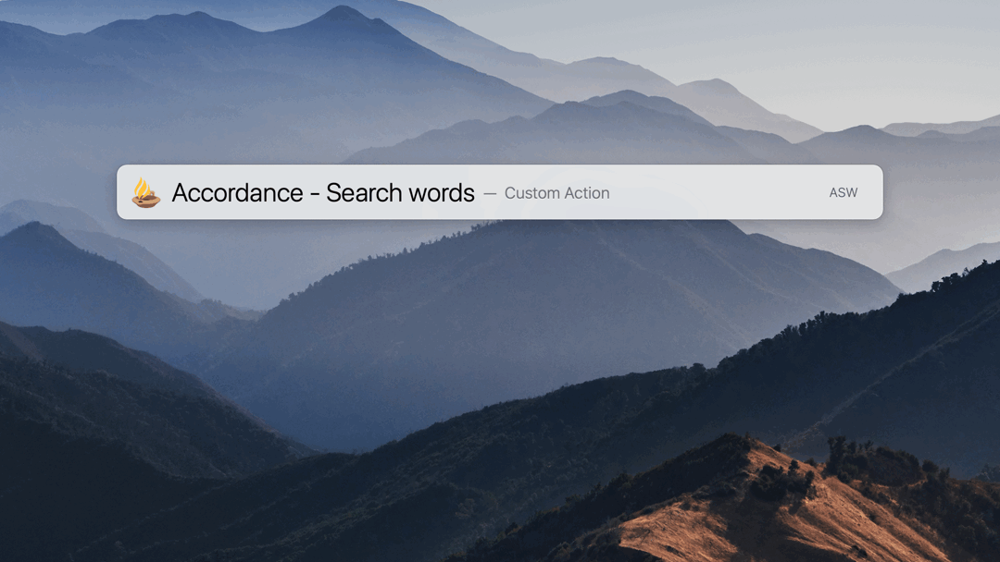

# LaunchBar Browser Actions
These actions require [Accordance Bible Software](https://www.accordancebible.com/). There is also a post related to these in the [Accordance Forums](https://forums.accordancebible.com/topic/5191-launchbar-scripts/). 

In order to make display and paste actions work properly it is suggested to set up citation settings like this in Accordcance: 

## Display in large type 

(Hint: Exit with ESC)

## Paste scripture

## Look up scripture 

## Search words
Per default spaces are replaced with "AND" tags or with "OR" tags when holding option. By holding command the string will stay as entered. 

You also can use "A" (AND), "O" (OR) or "N" (NOT) manually as shown here:    

## Download
[Download LaunchBar Accordance Actions](https://minhaskamal.github.io/DownGit/#/home?url=https://github.com/Ptujec/LaunchBar/tree/master/Accordance-Actions) (powered by [DownGit](https://github.com/MinhasKamal/DownGit))
