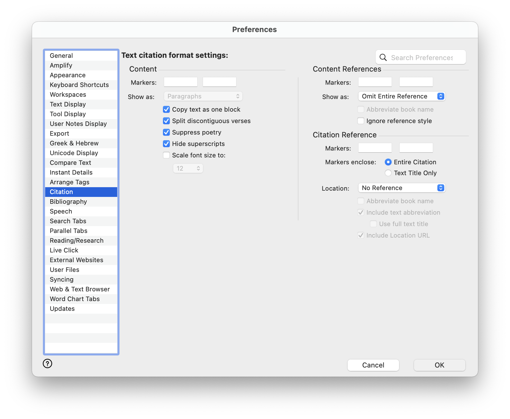

# LaunchBar Browser Actions
These actions require [Accordance Bible Software](https://www.accordancebible.com/). There is also a post related to these in the [Accordance Forums](https://forums.accordancebible.com/topic/5191-launchbar-scripts/). 

In order to make display and paste actions work properly it is suggested to set up citation settings like this in Accordcance: 

## Display in large type 

## Paste scripture

## List
- Display in large type
- Paste scripture (with an option (⌘⏎) to paste as Markdown blockquote)
- Look up scripture 
- Search words

## Download
[Download LaunchBar Accordance Actions](https://minhaskamal.github.io/DownGit/#/home?url=https://github.com/Ptujec/LaunchBar/tree/master/Accordance-Actions) (powered by [DownGit](https://github.com/MinhasKamal/DownGit))
