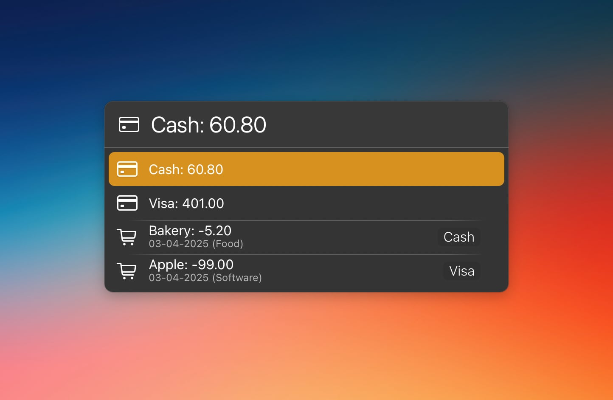

# LaunchBar Action: Actual Budget

*[→ See a list of all my actions here.](https://ptujec.github.io/launchbar)* 

[Actual Budget](https://actualbudget.org/) is a free and [open-source](https://github.com/actualbudget/actual) alternative to YNAB. I don't love that the macOS client is an Electron app, but the project is pretty well maintained and does what I need.

The following actions are trying to improve the experience a little.

## Actual Budget (Accounts, Transactions, and Categories)

This action displays account balances and the most recent transactions.

You can show category balances and budgets with `command` + `enter`. Depending on your database size, it may take a little, because right now it needs all transaction and budget data to calculate balances correctly.

If you have multiple budgets, you can select them with `option` + `enter`.

## Add Transaction

This action lets you add transactions. Start by pressing `space` to enter the amount.

Note: While the other action only reads data, this action writes directly to the database, which could lead to issues. Before doing so, it will close the app and always create a backup, which can be restored using the desktop app if needed. In addition, the action currently deletes the cache of the desktop app after creating a new transaction to ensure proper display of budgets. This will slow down the performance of the desktop app a little.

## Download & Update

[Click here](https://github.com/Ptujec/LaunchBar/archive/refs/heads/master.zip) to download this LaunchBar action along with all the others. Or simply use [LaunchBar Repo Updates](https://github.com/Ptujec/LaunchBar/tree/master/LB-Repo-Updates#launchbar-repo-updates-action)! It helps automate updating existing and installing new actions.