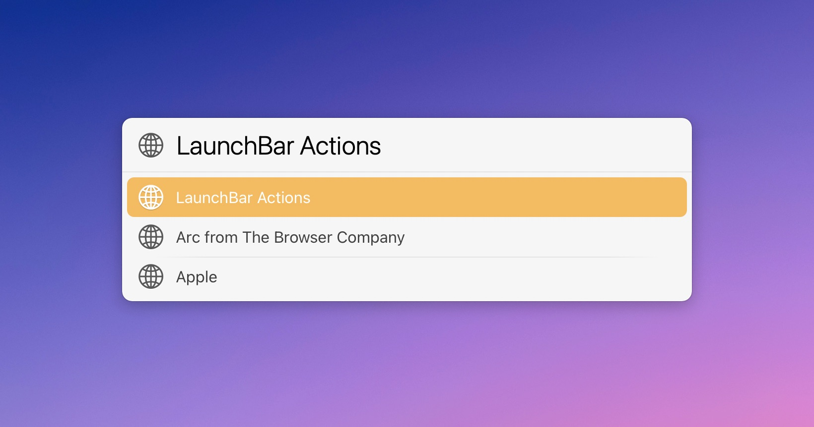

# LaunchBar Action: Arc History

*[→ See a list of all my actions here.](https://ptujec.github.io/launchbar)* 

This is a simple action that displays your browser history for [Arc](https://arc.net/). You can use it by simply selecting Arc in LaunchBar and pressing `space`. As always, you can type to narrow down results to what you are looking for. 

## Download
[Download LaunchBar Action: Arc History](https://minhaskamal.github.io/DownGit/#/home?url=https://github.com/Ptujec/LaunchBar/tree/master/Arc-History) (powered by [DownGit](https://github.com/MinhasKamal/DownGit))