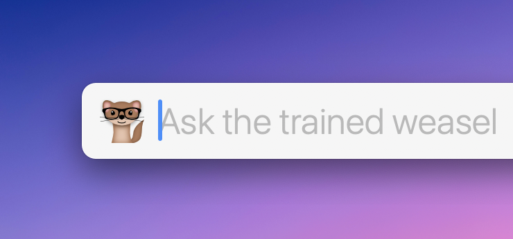

# LaunchBar Action: Ask ChatGPT

*[→ See a list of all my actions here.](https://ptujec.github.io/launchbar)* 

This action let's you send requests to ChatGPT. 

Press `space`, enter your question and hit `enter`. The answer will open in your default text editor as a simple markdown file. It works very well with [iA Writer](https://ia.net/writer). 

**Please take the [following quote](https://mastodon.social/@tess/110105460869464011) to heart while using this action** 😉: 

> … any time someone proposes doing anything with an ML model, you should replace “AI” in the proposal with “trained weasels” and if it still sounds like a good idea you can go ahead with it.

 

## Features: 

- If you ask a question within 5 minutes after the previous question you will be asked if you want to continue the current thread. You can also bring up this prompt by holding down `⌘`, when you send the question.
- Choose the between `gpt-3.5-turbo` and `gpt-4` models. 
- Reset API key with  `⌃` + `enter`. 

## Requirements

You need an [API key from OpenAI](https://platform.openai.com/account/api-keys) to use this action. 

## Known Issue

If you enter a question and something goes wrong you won't see a prompt until you bring up LB in the app switcher. This is because the action runs in the background to keep the action from blocking LB while it is running. 

## Download

[Download LaunchBar Action: Ask ChatGPT](https://minhaskamal.github.io/DownGit/#/home?url=https://github.com/Ptujec/LaunchBar/tree/master/Ask-ChatGPT) (powered by [DownGit](https://github.com/MinhasKamal/DownGit))

## Updates

This action integrates with Action Updates by @prenagha. You can find the [latest version in his Github repository](https://github.com/prenagha/launchbar). For more information and a signed version of Action Updates [visit his website](https://renaghan.com/launchbar/action-updates/).