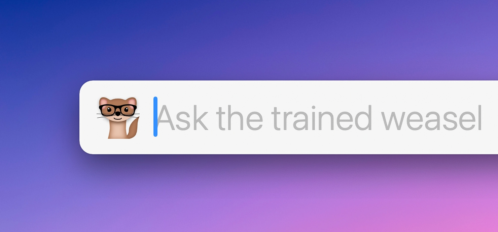
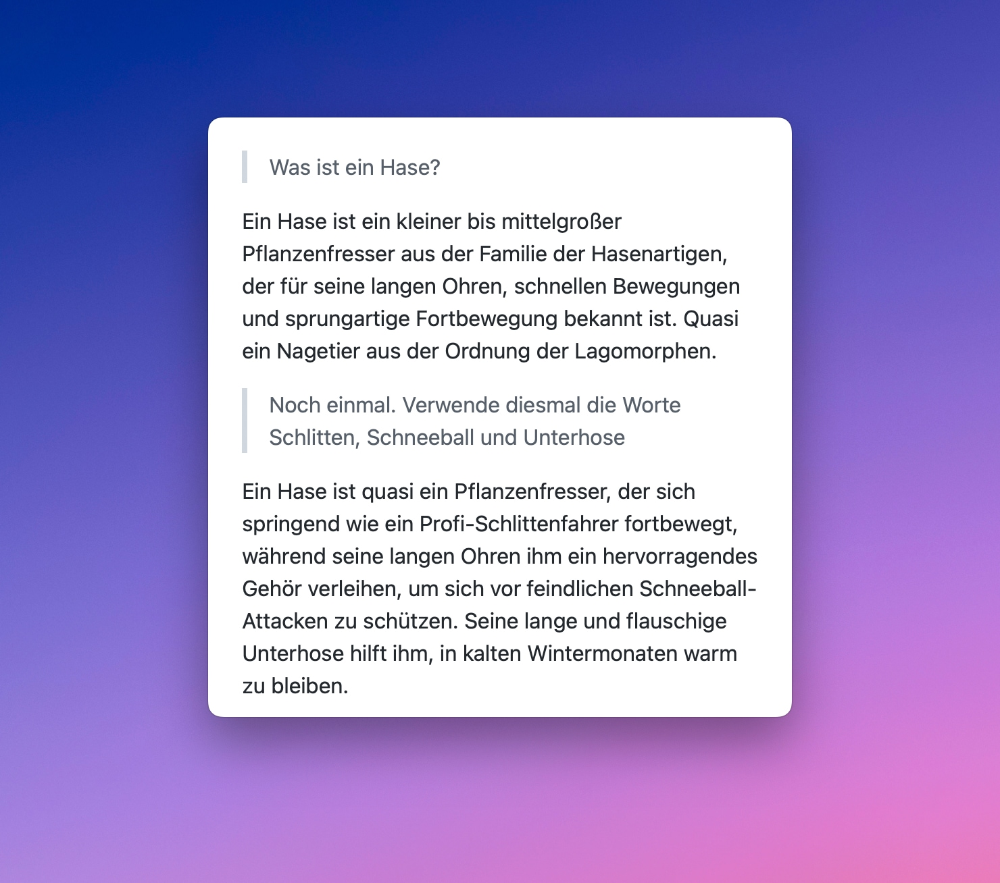

# LaunchBar Action: Ask ChatGPT

*[→ Click here to view a list of all my actions.](https://ptujec.github.io/launchbar)* 


This action allows you to send prompts to ChatGPT. 

 

## How It Works

Press `space` to enter a new prompt. If you have already started a chat, you can continue it, or start a new one. (Note: You can use an alternative system prompt with `command` + `enter` when you are done typing your prompt.)

You can also press `enter` to see all your past chats and continue any of them. Just press `enter` again. You can also use Quicklook here.

You do not need to wait while the answer is being generated. Everything happens in the background without affecting the LaunchBar interface.

## Chat Display

Once the answer is ready it will open as a simple **markdown file**. 

 

Additionally the answer is automatically copied to the **clipboard**.

This action works with any text editor, but especially well with a dedicated preview app for Markdown files like [Markdown Preview](https://markdownpreview.app/) or [Marked](https://markedapp.com/).

## Settings

Access the settings with `option` + `enter`. Here you can:

- Choose a default system prompt
- Choose between models
- Choose the reasoning effort level (for model gpt-5.2 and above)
- Choose an editor/viewer to display the resulting chats 
- Set or reset your API key
- Update, reset or customize system prompts 

## Customize system prompts

You can customize and add as many system prompts as you want, and choose an emoji as the icon to identify them easily. 

```
{
  "systemPrompts": [
    {
      "id": "assistant",
      "title": "Assistant",
      "icon": "weasel",
      "description": "This is the default",
      "systemPrompt": "You are a helpful assistant."
    }
  ]
}
```

## Requirements

To use this action, you need an [API key from OpenAI](https://platform.openai.com/account/api-keys) and good judgement on how to use a tool like this 😉. 

## Miscellaneous

- [ChipiChat](https://github.com/quinncomendant/ChipiChat.lbaction#chipichat-launchbarchatgpt) is an alternative LaunchBar action for ChatGPT with a lot more features. 
- Why the icon? [The answer is in this toot.](https://mastodon.social/@tess/110105460869464011)

## Download & Update

[Click here](https://github.com/Ptujec/LaunchBar/archive/refs/heads/master.zip) to download this LaunchBar action along with all the others. Or simply use [LaunchBar Repo Updates](https://github.com/Ptujec/LaunchBar/tree/master/LB-Repo-Updates#launchbar-repo-updates-action)! It helps automate updating existing and installing new actions.