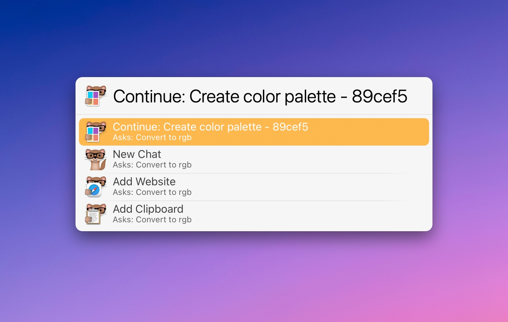
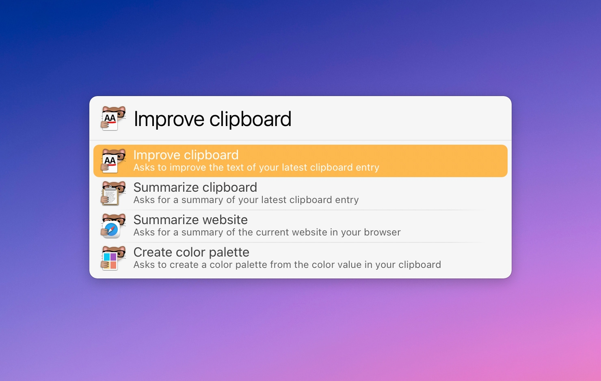
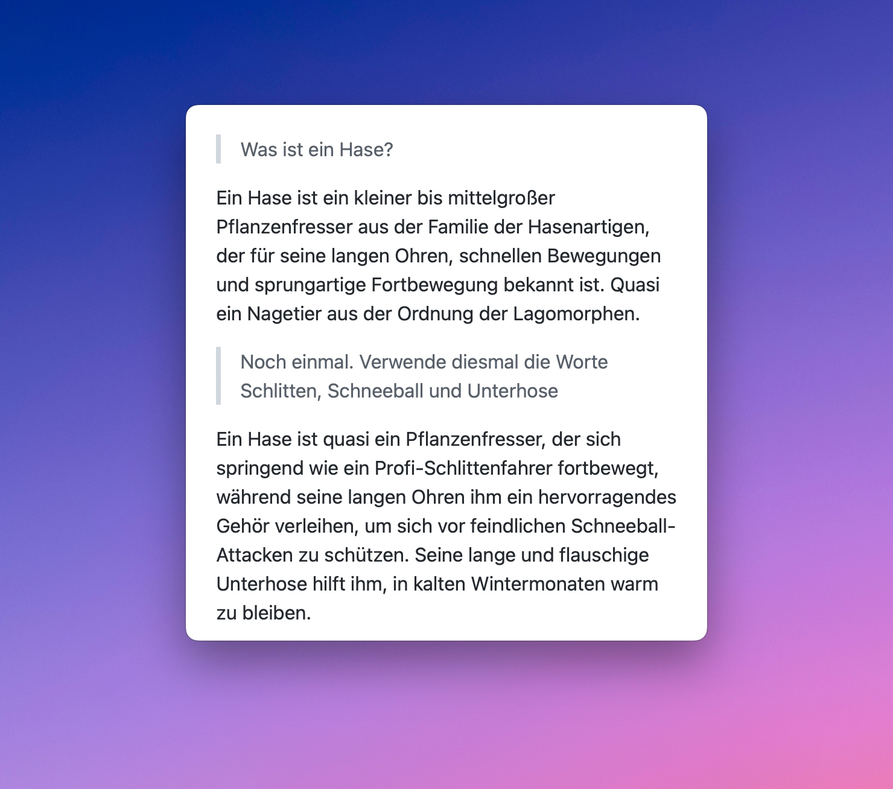

# LaunchBar Action: Ask ChatGPT

*[→ Click here to view a list of all my actions.](https://ptujec.github.io/launchbar)* 


This action allows you to send requests to ChatGPT. There are **two main ways to use it**:

### 1: Chat away 

 

Press `space` to start or continue a "conversation" with ChatGPT. Type your question or command, and then select one of the options presented to you, such as starting a new chat or continuing the current conversation.

 

### 2: Use predefined prompts 

Press `enter` to access a menu of predefined prompts. You can customize them in the [settings](#settings) to suit your needs. This is convenient for frequently used tasks.

 

### What’s next?

No need to wait while the answer is generated. All this is happening in the background without affecting the LaunchBar interface.

The chat will open as a simple **markdown file** when done. 

 

Additionally the answer is automatically copied to the **clipboard**.

This action works very well with [iA Writer](https://ia.net/writer) in preview mode. [Marked](https://marked2app.com/) is also a great option since it is specifically designed to preview markdown files.

### Additional Features

- To view recent chats, select the action in LaunchBar and press `command` + `enter` 
- Use alternative personas with `command` + `enter` when you are done entering text. 
- Optionally compare input and answer in [BBEdit](https://www.barebones.com/products/bbedit/) instead of creating a chat by setting `useCompare` to `true` in a custom prompt.

### Settings

Access the settings with `option` + `enter`. Here you can:

- Choose a default persona
- Choose between models
- Choose an editor to display the resulting chats 
- Set or reset your API key
- Update, reset or customize prompts and personas

### Customize prompts and personas

You can customize and add as many prompts and personas as you want, and choose an emoji as the icon to identify them easily. 

```
{
  "prompts": [
    {
      "icon": "✍🏻",
      "argument": "The instruction passed to the model",
      "title": "Your unique title",
      "addURL": false,
      "addClipboard": true,
      "description": "A description to display as the subtitle",
      "persona": "The persona for this task (optional)",
      "useCompare": true
    }
  ],
  "personas": [
    {
      "title": "Assistant",
      "icon": "weasel",
      "description": "This is the default persona",
      "persona": "You are a helpful assistant."
    }
  ]
}
```

## Requirements

To use this action, you need an [API key from OpenAI](https://platform.openai.com/account/api-keys) and good judgement on how to use a tool like this 😉. 

## Miscellaneous

- [ChipiChat](https://github.com/quinncomendant/ChipiChat.lbaction#chipichat-launchbarchatgpt) is a cool alternative LaunchBar action for ChatGPT. 
- Here is a [long list of interesting prompts](https://prompts.chat) that may serve as inspiration for both prompts and personas to use with this action.
- [QLMarkdown](https://github.com/sbarex/QLMarkdown) is a great Quick Look plugin for Markdown files.
- I really enjoyed [this episode of Changelog](https://changelog.fm/534#t=45:20) and especially [Simon's](https://github.com/simonw) take on LLMs.
- Why the icon? [The answer is in this toot.](https://mastodon.social/@tess/110105460869464011)

## Download

[Click here](https://github.com/Ptujec/LaunchBar/archive/refs/heads/master.zip) to download this LaunchBar action along with all the others. Or [clone](https://docs.github.com/en/repositories/creating-and-managing-repositories/cloning-a-repository) this repository.

## Updates

Use [Local Action Updates](https://github.com/Ptujec/LaunchBar/tree/master/Local-Action-Updates#launchbar-action-local-action-updates) to keep track of new versions of all my actions and discover new ones at the same time. 

This action also supports [Action Updates](https://github.com/prenagha/launchbar) by Padraic Renaghan.