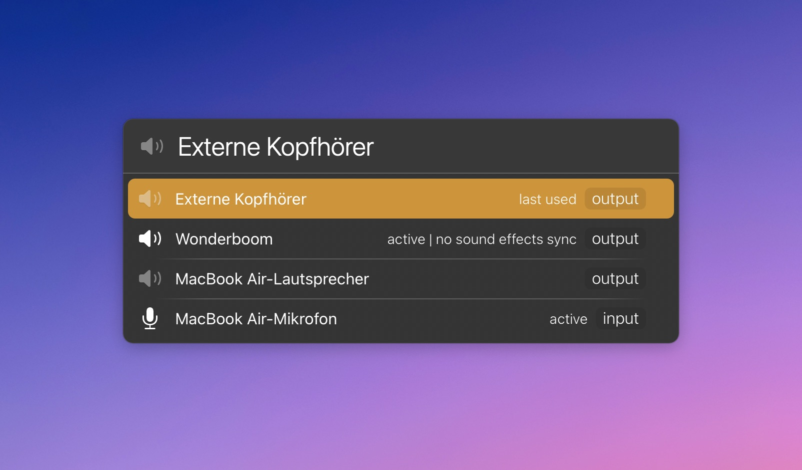

# LaunchBar Action: Audio Devices

This action allows you to switch between audio devices. 

## Features

Devices are **intentionally sorted** in a way that makes it easy to toggle between two output devices. 

**Exclude selected devices** with `Control` + `Enter`. You can show excluded devices with `Command` + `Enter`.

By default, **sound effects** (e.g. system alerts) will play on the new output device. You can prevent that by pressing `Option` + `Enter` on a selected output device.

If you hold `Command` when switching to a new output device, the list will be filtered by only input devices next, or vice versa.

## Note About AirPlay Devices

AirPlay devices are not fully supported yet. CoreAudio does not list AirPlay devices consistently. You can try to add or update AirPlay devices by holding `Shift`, but this is a workaround that involves GUI scripting, which is very fragile.

## Note About Swift Scripts

First, if you don't have **Apple's Command Line Tools** installed[^1], you will probably be prompted to do so. You will surely need them if you want to compile the script.

Swift scripts run faster when compiled. Unfortunately, I can't share the action with a compiled script. For security reasons, Apple adds a `com.apple.quarantine` attribute to every downloaded file. (You can check that in Terminal with `xattr` plus the path to the file.)

Just the added attribute is not necessarily a problem yet. But you will surely run into an issue when the main script file is an executable (the compiled script). If you want to run that, you will get a malware alert.

You can compile the `default.swift` file yourself with `swiftc -O default.swift`. You will need the above-mentioned Command Line Tools for that. Obviously, you also need to change the `LBScriptName` key in `info.plist`, pointing it to the executable.

Now you have the compiled executable, and you know it matches the source file because you compiled it yourself. But the action still won't run. This is because of the attribute on every other file in the action bundle. You can remove the attribute with LaunchBar's built-in `Open Anyway` action. Just be aware that this will remove the attribute from all files in that bundle. Potentially, there could be other executables that the main script refers to. So check the whole bundle before you do this. And only do it if you trust the source.

**I know that sounds like a lot. That is why I built [an action to make that process a little easier](https://github.com/Ptujec/LaunchBar/tree/master/Compile-Swift-Action#readme).**

## Miscellaneous

Padraic Renaghan has [a similar LaunchBar action](https://renaghan.com/launchbar/switch-audio/). Shout out also to George Karagkiaouris for his [macos-audio-devices](https://github.com/karaggeorge/macos-audio-devices) repo; this was very helpful. If you are using Alfred, have a look at [alfred-audio-switcher](https://github.com/TobiasMende/alfred-audio-switcher) by Tobias Mende. 

## Download
[Click here](https://github.com/Ptujec/LaunchBar/archive/refs/heads/master.zip) to download this LaunchBar action along with all the others. Or [clone](https://docs.github.com/en/repositories/creating-and-managing-repositories/cloning-a-repository) this repository.

## Updates

Use [Local Action Updates](https://github.com/Ptujec/LaunchBar/tree/master/Local-Action-Updates#launchbar-action-local-action-updates) to keep track of new versions of all my actions and discover new ones at the same time. 

This action also supports [Action Updates](https://renaghan.com/launchbar/action-updates/) by Padraic Renaghan.

[^1]: There is currently a [bug when installing command line tools as described](https://github.com/orgs/Homebrew/discussions/5723#discussioncomment-11185411). That's on Apple. But it doesn't matter. Try to install it as described in the linked thread.