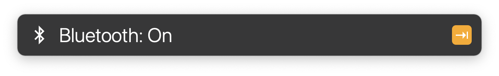

# Bluetooth Toggle for LaunchBar

## Limitations and other options

This action uses GUI scripting. There is a slight delay for opening System Preferences in the background. 

If you are looking for a non GUI version and more features you can try [this action by @django-wong](https://github.com/django-wong/launchbar-bluetooth-devices#readme). It requires installing a 3rd-party command-line tool though.

## Download

[Click here](https://github.com/Ptujec/LaunchBar/archive/refs/heads/master.zip) to download this LaunchBar action along with all the others. Or [clone](https://docs.github.com/en/repositories/creating-and-managing-repositories/cloning-a-repository) this repository.

## Updates

This action integrates with Action Updates by @prenagha. You can find the [latest version of Action Updates in his Github repository](https://github.com/prenagha/launchbar). For more information and a signed version of Action Updates [visit his website](https://renaghan.com/launchbar/action-updates/).
