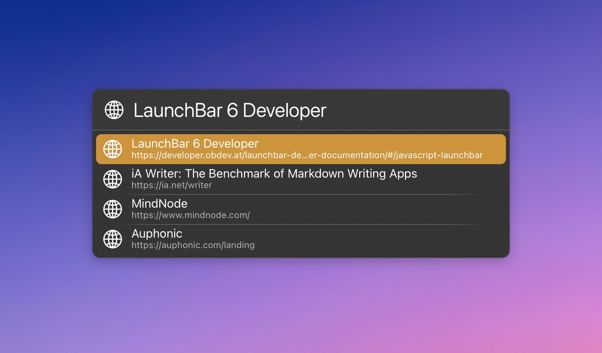

# LaunchBar Action: Brave Browser History

*[→ See a list of all my actions here.](https://ptujec.github.io/launchbar)* 

This is a simple action that displays your browser history for Brave Browser. You can use it by simply selecting Brave in LaunchBar and pressing `space`. As always, you can type to narrow down results to what you are looking for. 

## Download
[Click here](https://github.com/Ptujec/LaunchBar/Bravehive/refs/heads/master.zip) to download this LaunchBar action along with all the others. Or [clone](https://docs.github.com/en/repositories/creating-and-managing-repositories/cloning-a-repository) this repository.