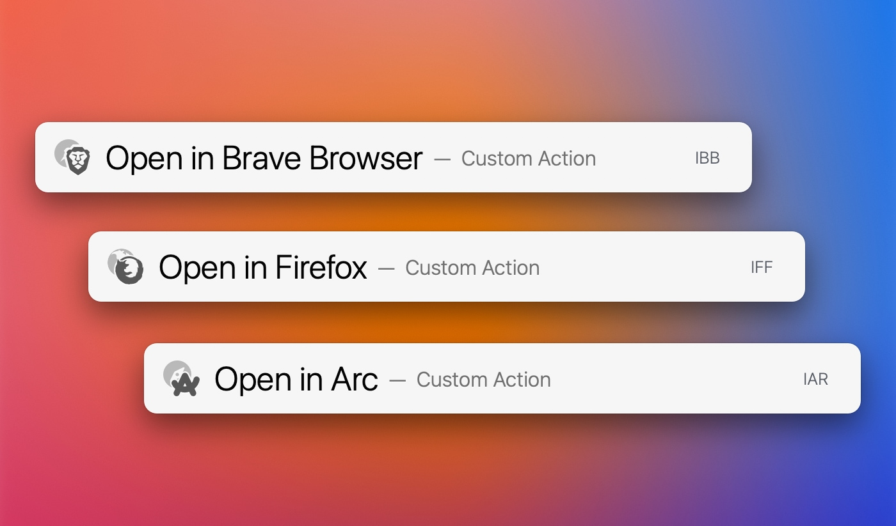

# LaunchBar Browser Actions

*[→ See a list of all my actions here.](https://ptujec.github.io/launchbar)* 

Open current URL in different Browser. Supported browsers: 
- Safari
- Brave
- Arc
- Firefox (**Note**: FF can be buggy because it has not sufficient AppleScript support!)
- Chrome

You can also close the site in the browser you came from with `⌘↩` (cmd-return). Set default behavior in settings `⇧↩` (shift-return). **Note**: Firefox can not close individual tabs, just windows! 

## Download
[Download LaunchBar Browser Actions](https://minhaskamal.github.io/DownGit/#/home?url=https://github.com/Ptujec/LaunchBar/tree/master/Browser-Actions) (powered by [DownGit](https://github.com/MinhasKamal/DownGit))