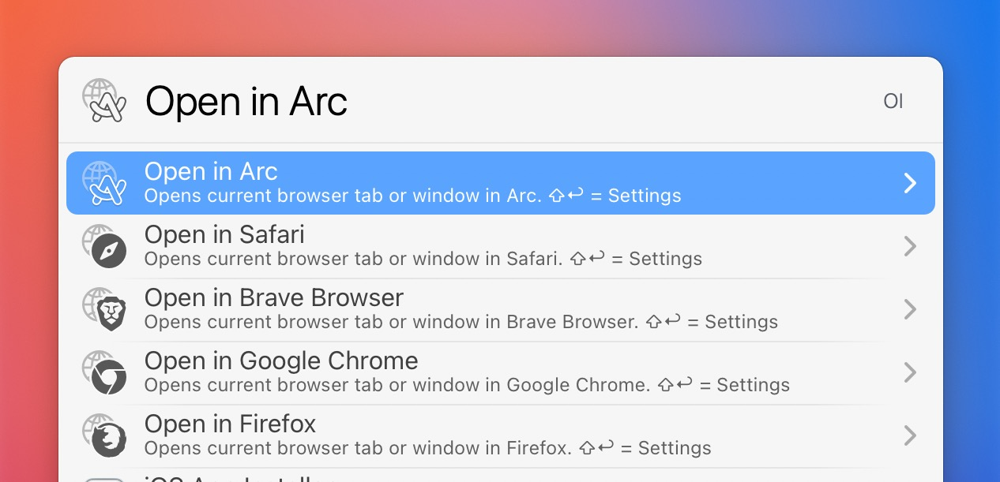

# LaunchBar Browser Actions

*[→ See a list of all my actions here.](https://ptujec.github.io/launchbar)* 

The actions are meant for opening the current tab or window in another browser. 

Supported browsers: 
- Safari
- Brave
- Arc
- Firefox 
- Chrome
- Vivaldi

You can also close the site in the browser you came from with `⌘↩` (cmd-return). Set default behavior in settings `⇧↩` (shift-return). 

### Good to know
- If you use the close option be aware that Firefox can not close individual tabs, just windows! 
- Getting an URL from Firefox might be buggy, because it lacks sufficient AppleScript support! If it's not working properly it might help to [increase delay times](https://github.com/Ptujec/LaunchBar/blob/1c6609e474f8916d9d65f83793f48ffbdc277f74/Browser-Actions/Open%20in%20Safari.lbaction/Contents/Scripts/default.js#L171).
- If you can, avoid using Chrome. [It's bad](https://chromeisbad.com). Brave seems like a good replacement.

## Download
[Download LaunchBar Browser Actions](https://minhaskamal.github.io/DownGit/#/home?url=https://github.com/Ptujec/LaunchBar/tree/master/Browser-Actions) (powered by [DownGit](https://github.com/MinhasKamal/DownGit))