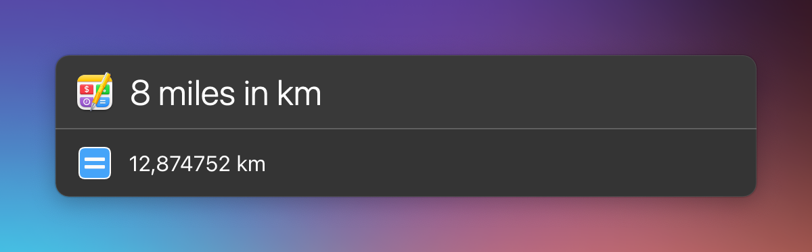

# LaunchBar Action: Calculate with Soulver

Use the calculating power of the excellent app [Soulver](https://soulver.app). The results will displayed as you type. 

 

Press `↓` to select a result and continue calculating. Press `↩` to select the result in LaunchBar. By default the result will be also copied to your clipboard. You can turn that off in settings `⇧↩`.

## Requirements

You need [Soulver 3](https://soulver.app) and the [CLI tool installed](https://documentation.soulver.app/documentation/command-line-tool-automator-and-services). 

## Download

[Download LaunchBar Action: Calculate with Soulver](https://minhaskamal.github.io/DownGit/#/home?url=https://github.com/Ptujec/LaunchBar/tree/master/Calculate-Soulver) (powered by [DownGit](https://github.com/MinhasKamal/DownGit))

## Updates

This action integrates with Action Updates by @prenagha. You can find the [latest version in his Github repository](https://github.com/prenagha/launchbar). For more information and a signed version of Action Updates [visit his website](https://renaghan.com/launchbar/action-updates/).