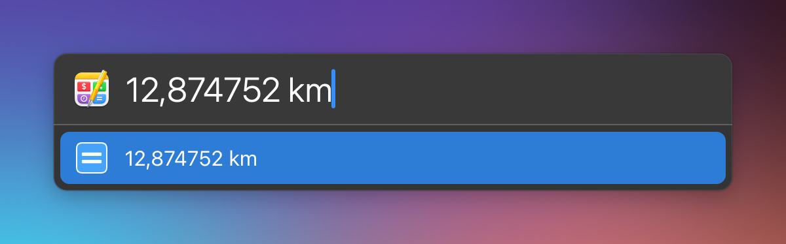

# LaunchBar Action: Calculate with Soulver

Use the calculating power of the excellent app [Soulver](https://soulver.app/features/). The results will displayed as you type. 

 

Press `↓` to select a result and continue calculating. 

 

Press `⌘` + `↩` to open the entry in Soulver. Paste the result in the active text field with `⇧` + `↩`. Select the result in LaunchBar simply with `↩` . 

## Requirements

If you have [Soulver 3](https://soulver.app) installed in the default location you are all set. 

The action relies on the [Soulver CLI](https://documentation.soulver.app/documentation/command-line-tool-automator-and-services), which is located inside Soulver's bundle. It expects to find it at `/Applications/Soulver 3.app/Contents/MacOS/CLI/soulver`.
If you rename the Soulver application, or put it in a different location you need to update the path in `default.js`.

## Download & Update

[Click here](https://github.com/Ptujec/LaunchBar/archive/refs/heads/master.zip) to download this LaunchBar action along with all the others. Or simply use [LaunchBar Repo Updates](https://github.com/Ptujec/LaunchBar/tree/master/LB-Repo-Updates#launchbar-repo-updates-action)! It helps automate updating existing and installing new actions.