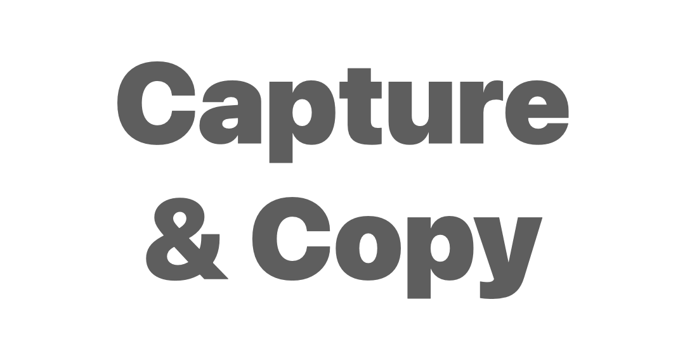
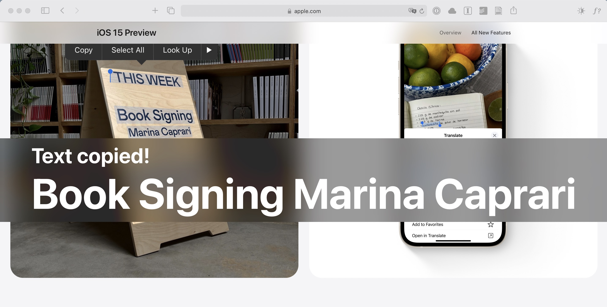
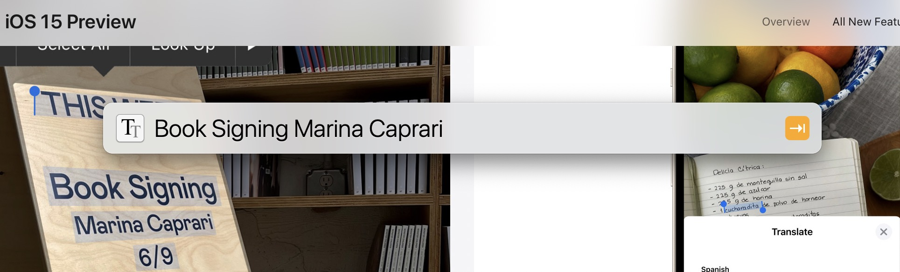
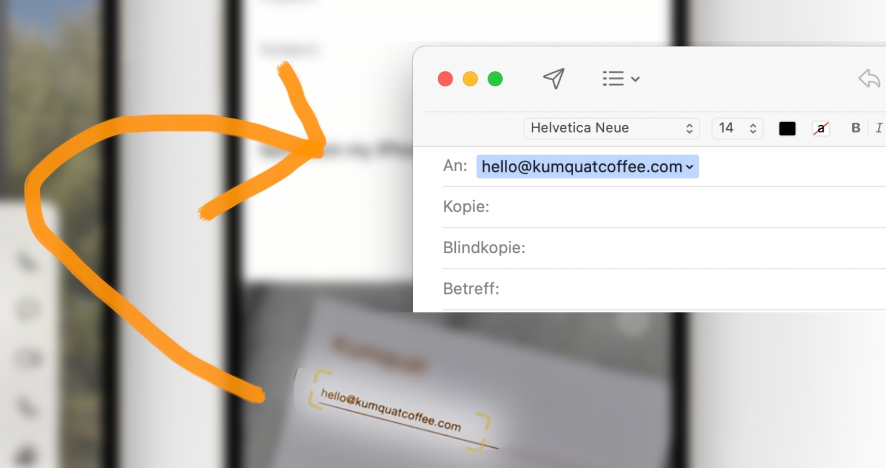

# LaunchBar Action: Capture Text (powered by macOCR)

 

## Installation 
This action is built upon the awesome command line app [macOCR](https://github.com/schappim/macOCR#readme) by  [Marcus Schappi](https://twitter.com/schappi). macOCR enables you to turn any text on your screen into text on your clipboard. **You have to [install macOCR](https://github.com/schappim/macOCR#installation) first to use the LaunchBar action.** 

## Features
**1) Capture & Copy:** 
Simply run the action and select the area with the text you want to capture. Done. You will get a large display confirmation with the copied text, which will hide automatically after a few seconds. 

 

**2) Capture & Select:**
Hold `⌘` while running the action to select the captured text in LaunchBar. 

 

**3) Capture & Open:** 
Hold `⇧` while running the action to automatically open captured links, email addresses or phone numbers.

 

## Download

[Click here](https://github.com/Ptujec/LaunchBar/archive/refs/heads/master.zip) to download this LaunchBar action along with all the others. Or [clone](https://docs.github.com/en/repositories/creating-and-managing-repositories/cloning-a-repository) this repository.