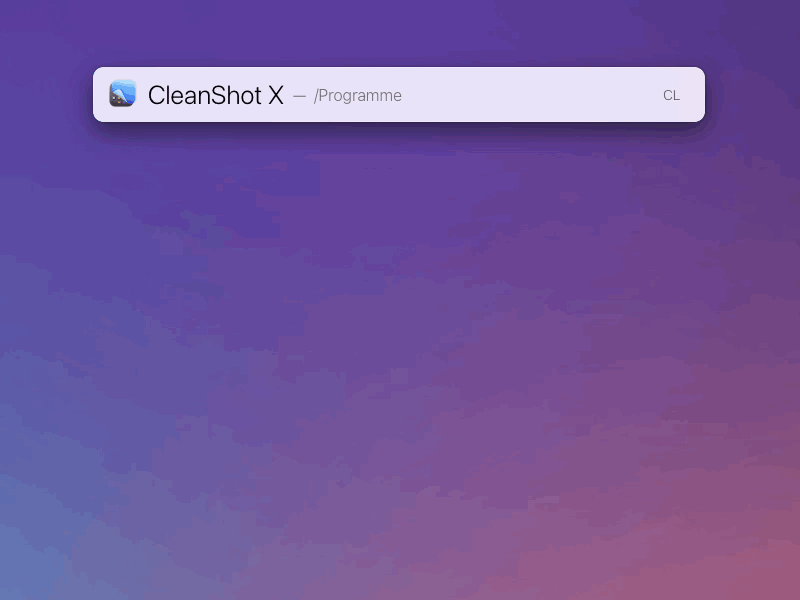

# LaunchBar Action: CleanShot X Functions

This is a simple action associated with the [app](https://cleanshot.com/) to access functions with LaunchBar. 

 

## Functions
- Capture Area
- Capture Previous Area
- Capture Fullscreen
- Capture Window
- Scrolling Capture
- Self-Timer
- Capture Text (OCR)
- Record Screen (Video/GIF)
- Toggles Desktop icons visiblity
- Restore recently closed item

[Here is the full list of accessible functions](https://cleanshot.com/docs/api). [Let me know if you are missing something.](https://github.com/Ptujec/LaunchBar/issues/new). 

## Download

[Download LaunchBar Action: CleanShot X Functions](https://minhaskamal.github.io/DownGit/#/home?url=https://github.com/Ptujec/LaunchBar/tree/master/CleanShot-X-Functions) (powered by [DownGit](https://github.com/MinhasKamal/DownGit))

## Updates

This action integrates with Action Updates by @prenagha. You can find the [latest version in his Github repository](https://github.com/prenagha/launchbar). For more information and a signed version of Action Updates [visit his website](https://renaghan.com/launchbar/action-updates/).