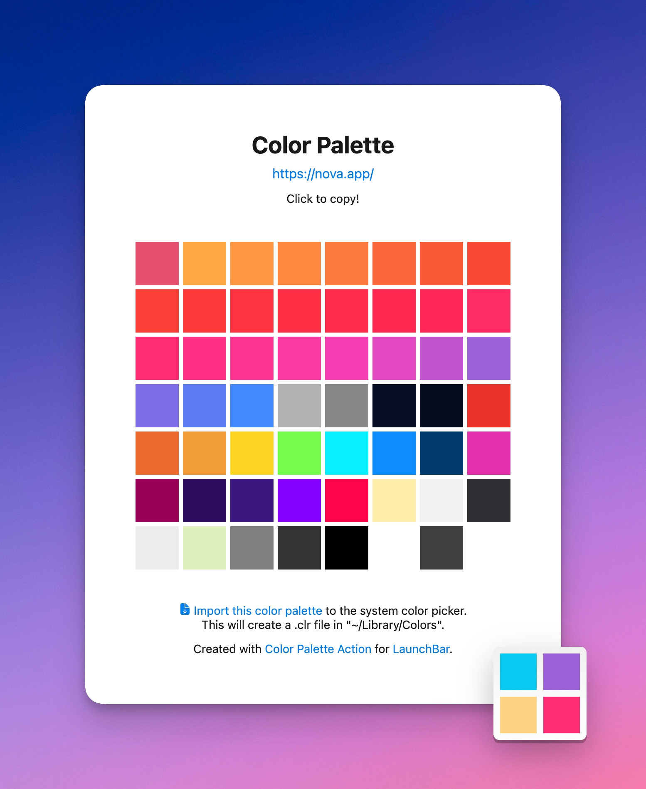
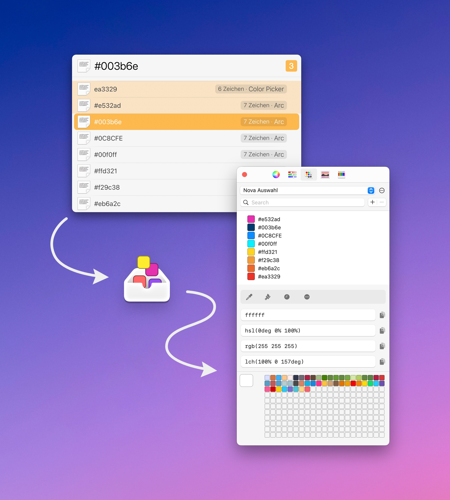

# LaunchBar Color Actions

*[→ Click here to view a list of all my actions.](https://ptujec.github.io/launchbar)*

## Color Palette from Website

 

This action extracts color codes (hex and rgba) from a website and puts them in a local HTML file. You can:

- Copy a color value by clicking on it. 
- Export the whole palette as a list to the system color picker. (Note: You might need to restart an app for new lists to appear in the color picker.)
- Browse files (with `space`).
- Choose a browser in which the files should be opened (with `option` + `enter`).

## Import Colors

 

This action is meant to be used with LaunchBar's "send to" feature. Select a list of color values, e.g., from the clipboard history, hit `tab`, select the action and press `enter`. 

## Miscellaneous

- [System Color Picker by Sindre Sorhus](https://sindresorhus.com/system-color-picker) puts the system color picker in a nice little app, with some helpful additions.
- Want to learn more about the Color Picker? [Macmost](https://www.youtube.com/watch?v=MQqntlvhGLg) and [robinwood](https://www.robinwood.com/Catalog/Technical/OtherTuts/MacColorPicker/MacColorPicker.html) have you covered.

## Download

[Download LaunchBar Color Action](https://minhaskamal.github.io/DownGit/#/home?url=https://github.com/Ptujec/LaunchBar/tree/master/Color-Actions) (powered by [DownGit](https://github.com/MinhasKamal/DownGit))

## Updates

This action integrates with Action Updates by @prenagha. You can find the [latest version in his Github repository](https://github.com/prenagha/launchbar). For more information and a signed version of Action Updates, [visit his website](https://renaghan.com/launchbar/action-updates/). 