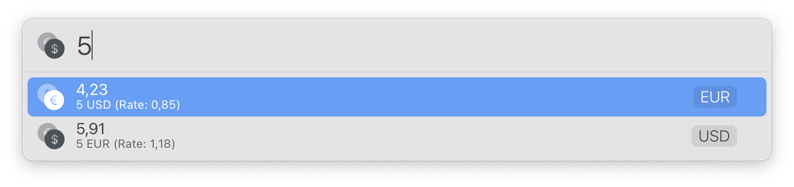
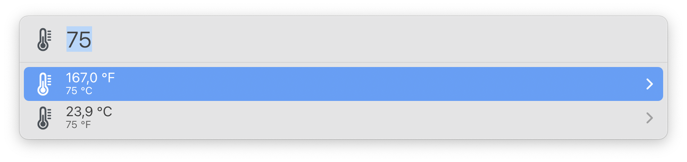

# LaunchBar Converter Actions

*[→ See a list of all my actions here.](https://ptujec.github.io/launchbar)* 

 

## Currency converter actions: 

- Dollar ⇄ Euro 
- Kuna ⇄ Euro
- Euro ⇄ Pound 
- USD ⇄ INR

The currency converter actions require an API key. You can get one for free at [https://exchangeratesapi.io/pricing/](https://exchangeratesapi.io/pricing/))

## Other:
- Celsius ⇄ Fahrenheit

## Download

[Download LaunchBar Converter Actions](https://minhaskamal.github.io/DownGit/#/home?url=https://github.com/Ptujec/LaunchBar/tree/master/Converter-Actions) (powered by [DownGit](https://github.com/MinhasKamal/DownGit))

## Updates

This action integrates with Action Updates by @prenagha. You can find the [latest version in his Github repository](https://github.com/prenagha/launchbar). For more information and a signed version of Action Updates [visit his website](https://renaghan.com/launchbar/action-updates/).