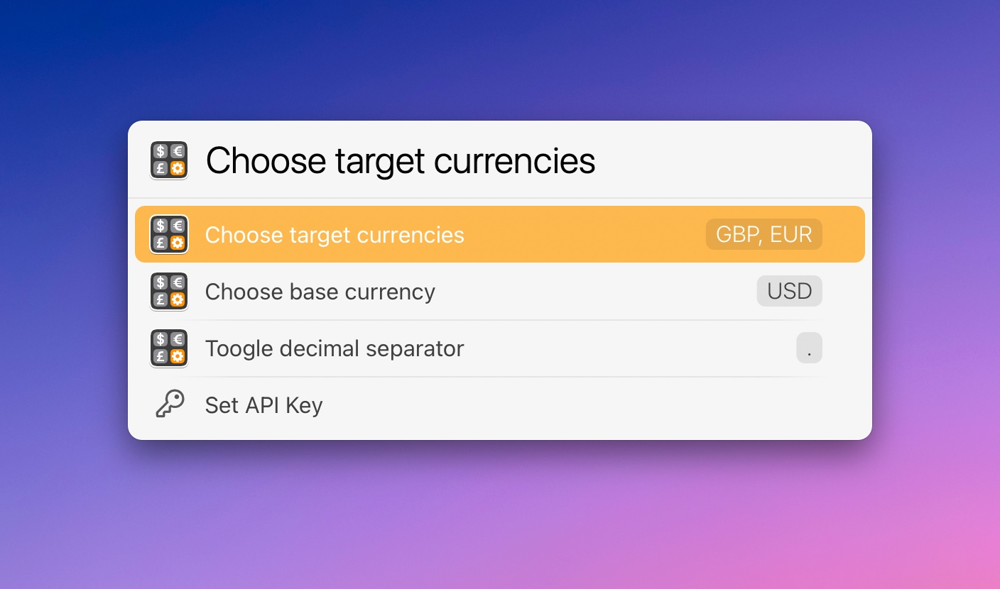

# LaunchBar Converter Actions

*[→ See a list of all my actions here.](https://ptujec.github.io/launchbar)* 

## Currency converter action: 

 

The purpose of this action is to convert currencies you use frequently with as little input as necessary. 

You can use `.` or `,` as decimal separators. Group separators are not supported currently. You can show a detailed view or do the usual things with a selected result (e.g. paste with `Shift (⇧)` + `Enter (↩)`).

 

**Settings:** Press `Shift (⇧)` +  `Enter (↩)` when the action is selected to get to settings.

 

**NOTE:** The currency converter action requires an API key. You can get one for free [here](https://apilayer.com/marketplace/exchangerates_data-api). (The Exchangerates API is built and maintained by APILayer).

## Other actions:
- Celsius ⇄ Fahrenheit

## Download

[Download LaunchBar Converter Actions](https://minhaskamal.github.io/DownGit/#/home?url=https://github.com/Ptujec/LaunchBar/tree/master/Converter-Actions) (powered by [DownGit](https://github.com/MinhasKamal/DownGit))

## Updates

This action integrates with Action Updates by @prenagha. You can find the [latest version in his Github repository](https://github.com/prenagha/launchbar). For more information and a signed version of Action Updates [visit his website](https://renaghan.com/launchbar/action-updates/).