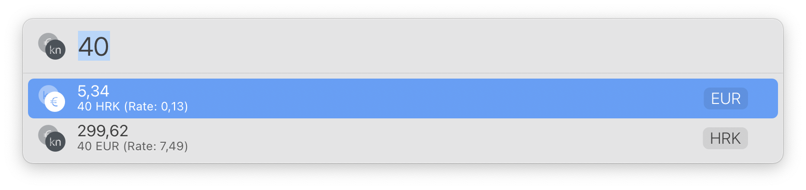

# LaunchBar Converter Actions

 

## List

- Dollar ⇄ Euro (requires an API key. You can get one for free at [https://exchangeratesapi.io/pricing/](https://exchangeratesapi.io/pricing/))
- Kuna ⇄ Euro
- Temperatur - Celsius ⇄ Fahrenheit

## Download
[Download LaunchBar Converter Actions](https://minhaskamal.github.io/DownGit/#/home?url=https://github.com/Ptujec/LaunchBar/tree/master/Converter-Actions) (powered by [DownGit](https://github.com/MinhasKamal/DownGit))