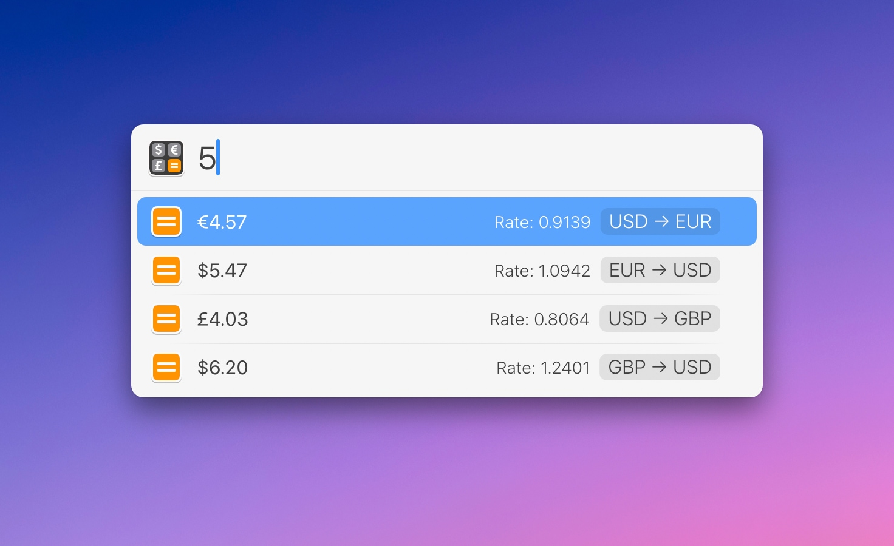

# LaunchBar Converter Actions

*[→ See a list of all my actions here.](https://ptujec.github.io/launchbar)* 

## Currency converter action: 

 

**The purpose of this action is to convert currencies you use frequently with as little input as necessary.** 
 
You can drill into each result for a detailed view. Of course you can do the usual things with a selected result (e.g. paste with `Shift (⇧)` + `Enter (↩)`).

 

If you hit return on a currency rate in the detailed view you will be taken to Google Finance.

**Settings:** Press `Shift (⇧)` +  `Enter (↩)` when the action is selected to get to settings.

**NOTE: This action requires an API key.** You can get one for free [here](https://apilayer.com/marketplace/exchangerates_data-api). The Exchange rates API is built and maintained by APILayer.

*If the local currency data has not been updated within the last 4 hours, the action will make a new API call. This hopefully is a good balance between accuracy and being economical with API calls.*

## Other actions:
- Celsius ⇄ Fahrenheit

## Download

[Download LaunchBar Converter Actions](https://minhaskamal.github.io/DownGit/#/home?url=https://github.com/Ptujec/LaunchBar/tree/master/Converter-Actions) (powered by [DownGit](https://github.com/MinhasKamal/DownGit))

## Updates

This action integrates with Action Updates by @prenagha. You can find the [latest version in his Github repository](https://github.com/prenagha/launchbar). For more information and a signed version of Action Updates [visit his website](https://renaghan.com/launchbar/action-updates/).
