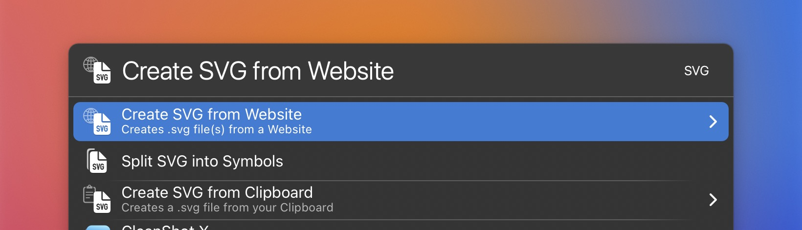

# LaunchBar Actions to create SVG files

 

**Create SVG from Website:** This will pull .svg files and svg code from the current website in Safari and place them at your fingertips. From here it is super easy to preview them with Quicklook (`‌␣`) or open them in your graphic tool or editor of choice (`⇥`). 

*Note: Some websites (e.g. 1password.com) store links to svg files in other places like meta tags. You can find them when using `⌥↩`. Depending on the website this can take much longer*.

**Split SVG into Symbols:** Sometimes there are multiple icons bundled in one file. This action can help split them up in single files.

**Create SVG from Clipboard:** If you copied some svg code and want to turn it into a file this action should help. 

## Download

[Download LaunchBar Action: DeepL Translator](https://minhaskamal.github.io/DownGit/#/home?url=https://github.com/Ptujec/LaunchBar/tree/master/Create-SVG-Files) (powered by [DownGit](https://github.com/MinhasKamal/DownGit))

## Updates

This action integrates with Action Updates by @prenagha. You can find the [latest version in his Github repository](https://github.com/prenagha/launchbar). For more information and a signed version of Action Updates [visit his website](https://renaghan.com/launchbar/action-updates/).