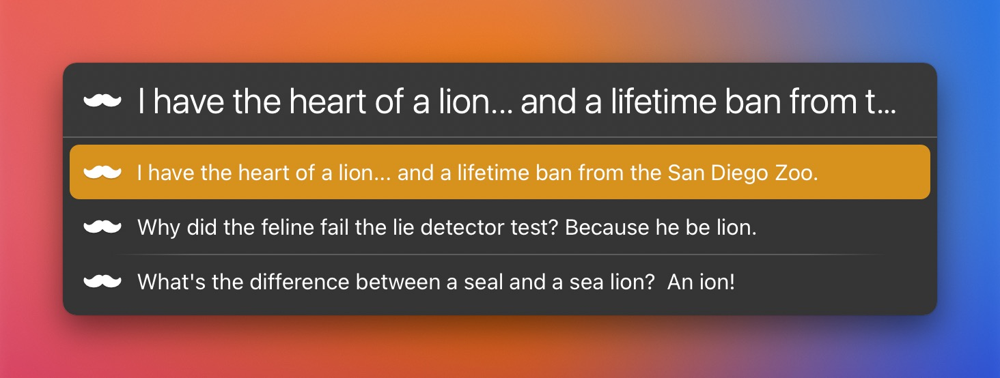

# LaunchBar Action: Dad Jokes

 

Display a random dad joke from https://icanhazdadjoke.com. Or search for a specific term with `␣` (space). 

The full text of your search results might not be displayed in the interface. Press `↩` to show the full text of a selected item along with an option to save the joke as a favorite. 

Favorites are stored in a plain text file at `iCloud Drive/Shortcuts/dadjokes.txt`. Display your favorites with `⇧↩`. Open the text file with `⌘↩`.

## Download

[Click here](https://github.com/Ptujec/LaunchBar/archive/refs/heads/master.zip) to download this LaunchBar Action along with all the others. Or [clone](https://docs.github.com/en/repositories/creating-and-managing-repositories/cloning-a-repository) this repository.

## Updates

This action integrates with Action Updates by @prenagha. You can find the [latest version in his Github repository](https://github.com/prenagha/launchbar). For more information and a signed version of Action Updates [visit his website](https://renaghan.com/launchbar/action-updates/).