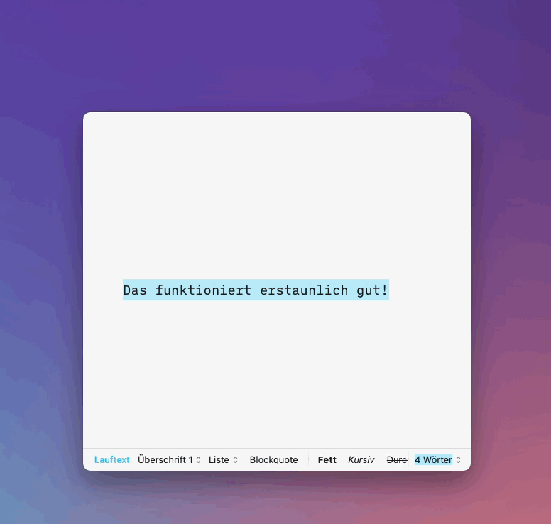

# LaunchBar Action: DeepL Translator

 

## Setup and options

You need an API key for this action, which you can copy from here after you create an account: [https://www.deepl.com/de/pro-account/summary](https://www.deepl.com/de/pro-account/summary). There is a free plan. You still need to enter your credit card information though.

You will be prompted to add your API key on the first run. You can set a new one with `⇧⏎` (shift + return).

## Usage

Enter the phrase you want to translate with `␣` (space bar) or set the target language with `⏎` (return).

## Supported Languages

The action supports all available target languages listed here: 
https://www.deepl.com/de/docs-api/translating-text/request/ 

(Last update: 2023-01-28)

## Download

[Download LaunchBar Action: DeepL Translator](https://minhaskamal.github.io/DownGit/#/home?url=https://github.com/Ptujec/LaunchBar/tree/master/DeepL-Action) (powered by [DownGit](https://github.com/MinhasKamal/DownGit))

## Updates

This action integrates with Action Updates by @prenagha. You can find the [latest version in his Github repository](https://github.com/prenagha/launchbar). For more information and a signed version of Action Updates [visit his website](https://renaghan.com/launchbar/action-updates/).