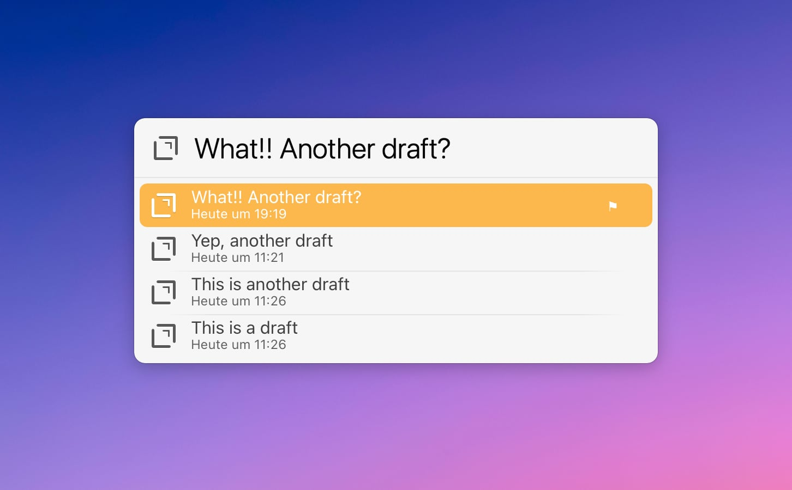

# Drafts LaunchBar Actions 

## Recent Drafts 

A simple action to show recent drafts and open them in the app.

The action is associated with [Drafts](https://getdrafts.com/), so you can simply select Drafts and press `space` to show your notes. Narrow down the results by typing as usual.

## Search Drafts

This action lets you search for content in your drafts. It'll prioritize results with a hit in the title. The subtitle shows the date it was last accessed and a snippet of the context of the hit.

## Download & Update

[Click here](https://github.com/Ptujec/LaunchBar/archive/refs/heads/master.zip) to download the LaunchBar actions in this folder along with all the others. Or simply use [LaunchBar Repo Updates](https://github.com/Ptujec/LaunchBar/tree/master/LB-Repo-Updates#launchbar-repo-updates-action)! It helps automate updating existing and installing new actions.