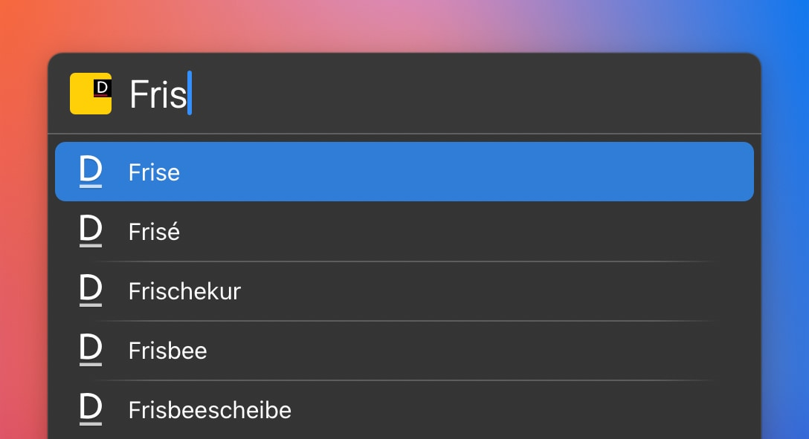

# LaunchBar Action: Duden 

 

Diese Aktion vervollständigt Suchbegriffe, so wie wenn man einen Begriff auf duden.de eingibt. Dadurch vermeidet man Suchen, die keinen Treffer auf duden.de haben. Nach Bestätigung durch `‌↩` werden die Suchtreffer incl. kurzer Bestimmung angezeigt. Nach erneuter Bestätigung durch `↩` wird die Website für den ausgewählten Suchtreffer (mit Rechtschreibung, Bedeutungen etc.) angezeigt.  

## Download

[Download LaunchBar Action: Duden](https://minhaskamal.github.io/DownGit/#/home?url=https://github.com/Ptujec/LaunchBar/tree/master/Duden-Action) (powered by [DownGit](https://github.com/MinhasKamal/DownGit))

## Updates

This action integrates with Action Updates by @prenagha. You can find the [latest version in his Github repository](https://github.com/prenagha/launchbar). For more information and a signed version of Action Updates [visit his website](https://renaghan.com/launchbar/action-updates/).