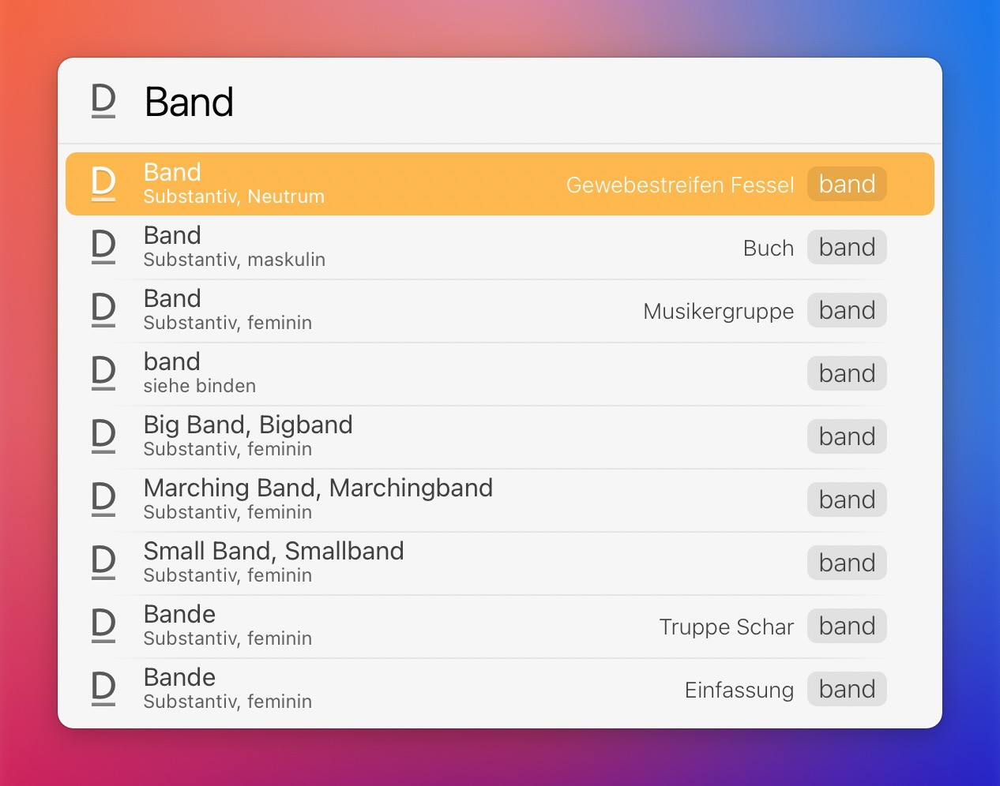

# LaunchBar Action: Duden 

 

Diese Aktion vervollständigt Suchbegriffe, so wie wenn man einen Begriff auf duden.de eingibt. Dadurch vermeidet man Suchen, die keinen Treffer auf duden.de haben. Nach Bestätigung durch `↩` werden die Suchtreffer incl. kurzer Bestimmung angezeigt (s. Screenshot). Nach erneuter Bestätigung durch `↩` wird die Website für den ausgewählten Suchtreffer (mit Rechtschreibung, Bedeutungen etc.) angezeigt.  

## Download & Update

[Click here](https://github.com/Ptujec/LaunchBar/archive/refs/heads/master.zip) to download this LaunchBar action along with all the others. Or simply use [LaunchBar Repo Updates](https://github.com/Ptujec/LaunchBar/tree/master/LB-Repo-Updates#launchbar-repo-updates-action)! It helps automate updating existing and installing new actions.