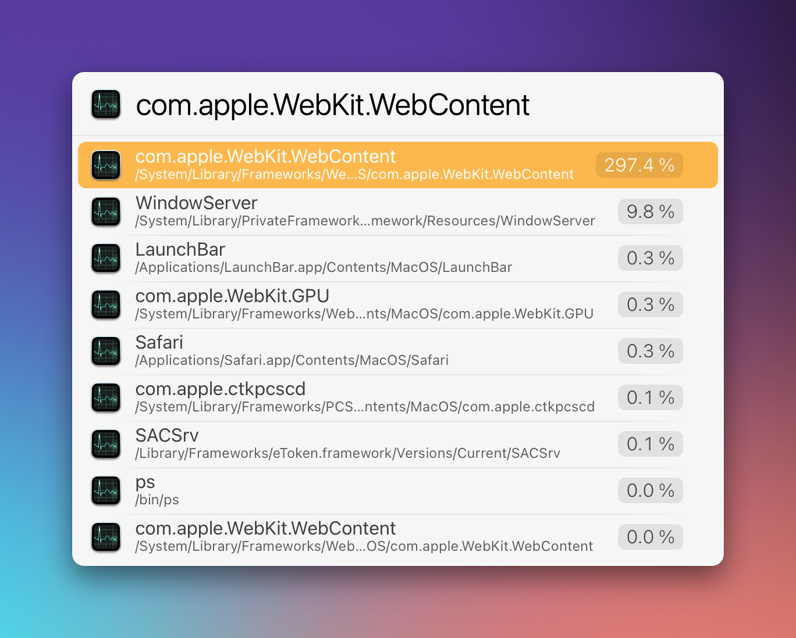

# LaunchBar Action: Every Process 

This action lists current running processes sorted by CPU usage percentage. You can easily filter for a specific process by typing (as usual with LaunchBar). The action is also helpful to see if a process is going crazy. You can test that with a site like [CPU Stress Test](https://cpux.net/cpu-stress-test-online).

 

You can press return `↩` to kill a selected process. Press `⌥↩` to reveal the executable of the selected process in `Finder`. 

**Note:** It is totally normal that both `WindowServer` and `LaunchBar` are fairly high, it reflects what you where just doing. You get a more "realistic" picture if you delay the terminal command the action is built upon (with `⇧↩`). It still is **only a snapshot** and CPU usage changes constantly. So please use Activity Monitor for a more accurate picture over time. 
You can also use arrow keys `←` `→` to "refresh" the action fairly quickly. 

## Download

[Click here](https://github.com/Ptujec/LaunchBar/archive/refs/heads/master.zip) to download this LaunchBar action along with all the others. Or [clone](https://docs.github.com/en/repositories/creating-and-managing-repositories/cloning-a-repository) this repository.

## Updates

This action integrates with Action Updates by @prenagha. You can find the [latest version in his Github repository](https://github.com/prenagha/launchbar). For more information and a signed version of Action Updates [visit his website](https://renaghan.com/launchbar/action-updates/).