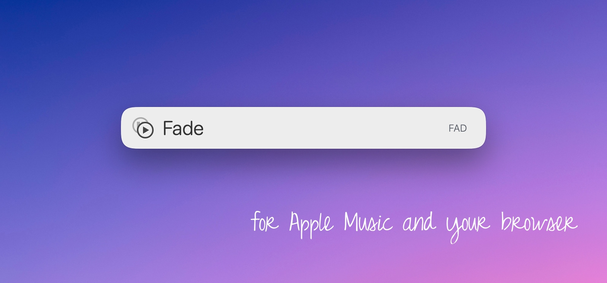

# LaunchBar Action: Fade

*[→ See a list of all my actions here.](https://ptujec.github.io/launchbar)* 

This action will fade out or fade in the audio playing in Apple Music or in your browser.

Here’s how it works: The action checks whether audio is playing in a browser tab or in Apple Music, and then fades it out.

The action will remember the last app and, for browser tabs, the last URL. So next time, it will fade in the last used source. If the browser tab no longer exists, it will check whether there’s something else to play.

You can force Apple Music by holding down `command`.

## About Browsers (Important!)

For browser support to work, **you need to allow JavaScript for Apple Events** for each browser. By default, it is turned **off**. To turn it on in Safari, go to `Settings` ‣ `Developer` ‣ `Automation`. In Chromium browsers, you can usually find the option in the `View` ‣ `Developer` menu. 

This action should work with most common browsers (e.g. Safari, Chrome, Brave …). When you run it, it also checks your Applications folder for new supported browsers. Firefox and other Gecko-based browsers, including Zen, are not supported. You can also add browsers from your Applications folder manually by holding `option` when running the action. Let me know if something doesn’t work as expected.

## Download & Update

[Click here](https://github.com/Ptujec/LaunchBar/archive/refs/heads/master.zip) to download this LaunchBar action along with all the others. Or simply use [LaunchBar Repo Updates](https://github.com/Ptujec/LaunchBar/tree/master/LB-Repo-Updates#launchbar-repo-updates-action)! It helps automate updating existing and installing new actions.