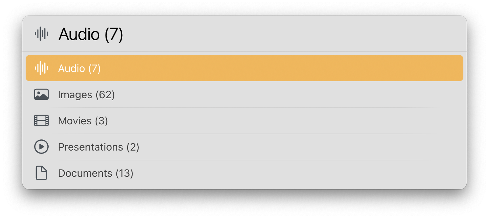

# LaunchBar File Actions

## List 
- Sort folder content by extension
- Filter folder content by type (images, movies, presentations, audio, documents) Note: Choosing good categories for all kind of file types is hard to impossible to do. So this action has just a few. It is mainly based on UTI type declarations provided in plists by the system and installed apps. It's not perfect and requires some manual sorting. But it performs very well. I first tried to loop through the files in a folder and get info via the command line for each file. But that made it very slow.  
- Filter folder content by extension
- Filter images
- Rename file with Selection (does not work with Electron apps)

## Download

[Click here](https://github.com/Ptujec/LaunchBar/archive/refs/heads/master.zip) to download this LaunchBar Action along with all the others. Or [clone](https://docs.github.com/en/repositories/creating-and-managing-repositories/cloning-a-repository) this repository.
