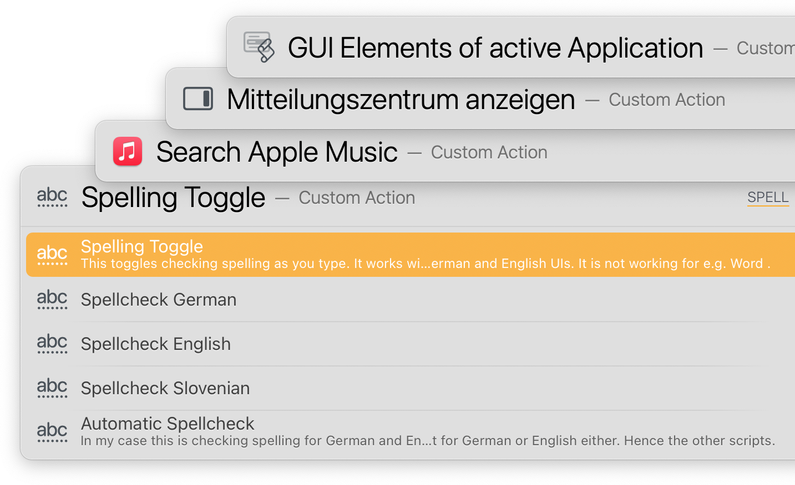

# LaunchBar GUI Scripting Actions

## Installation
These actions are created for use with [LaunchBar](http://www.obdev.at/products/launchbar/). Download and double click to install.

## GUI scripting
The actions in this repository depend on [GUI scripting](http://www.macosxautomation.com/applescript/uiscripting/). GUI scripting is fragile. If Apple or developers make changes to the UI menus involved things will break. Also if you use a different language. My default is German. **So most of these probably won't work out of the box if your UI language is not German.**

But GUI scripting sometimes is the only way to make things happen. And these are some of the most useful in my personal workflow.  

There is one action that can help you fix things. "**GUI Elements of active Application**" creates lists with all the available elements for GUI scripting of whatever app is active as you run it.   
