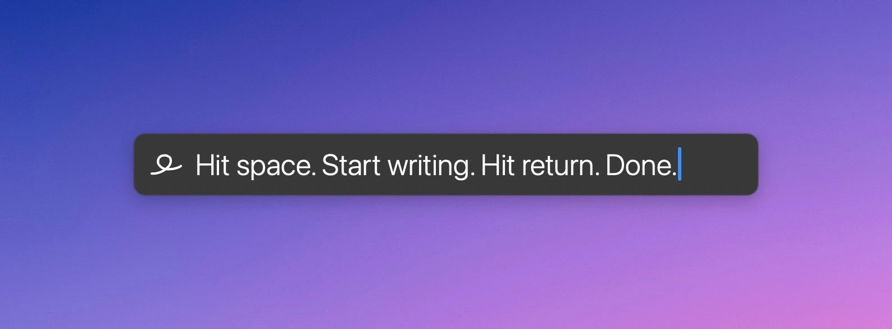
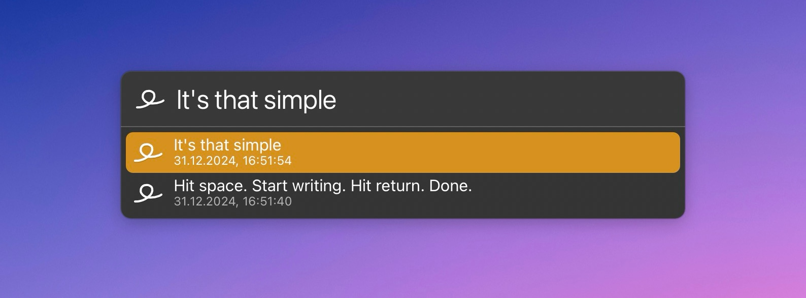

# LaunchBar Action: Gedankensalat (Scratchpad)

The use case for this is when you are working on something, and a random thought comes to your mind. As a LaunchBar user, hitting `command` + `space` and typing away should be the quickest way to capture a random thought. This is what this action is for.

Just select the action, press `space` again, and write down what's on your mind, then keep doing what you are doing.

Later, you can go back and decide what to do with it. Hit `enter` to view your list of entries.

You can easily remove items with `command` + `return`, or you can pass them on to an app or another action. 

BTW, `control` + `return` will open the text file in your default editor.

## Settings

The items are stored in a simple text file. You can choose a file or create a new file with `option` + `return`.

## Download & Update

[Click here](https://github.com/Ptujec/LaunchBar/archive/refs/heads/master.zip) to download this LaunchBar action along with all the others. Or simply use [LaunchBar Repo Updates](https://github.com/Ptujec/LaunchBar/tree/master/LB-Repo-Updates#launchbar-repo-updates-action)! It helps automate updating existing and installing new actions.