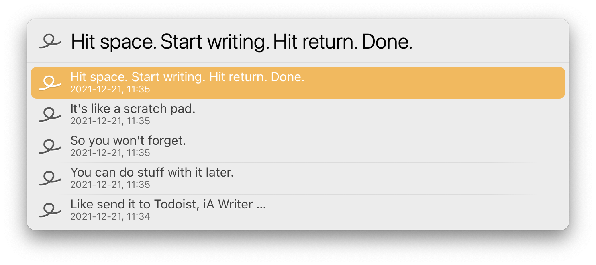
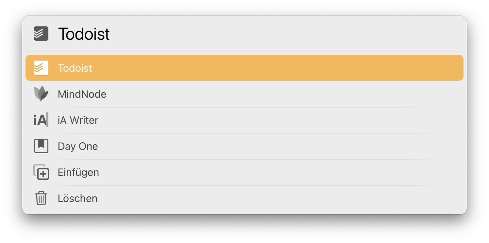
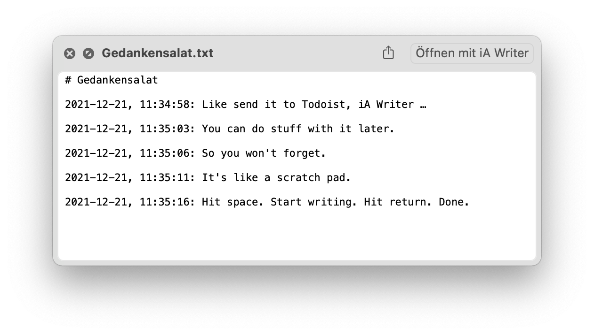

# LaunchBar Action: Gedankensalat (Scratchpad)

The use-case of this is for when you working on something and a random thought comes to your mind. As a LaunchBar user hitting `⌘ ␣` (command-space), `␣` (space) and type away should be the quickest way to capture a random thought. This is what this action is for. 

Write the thought down and keep doing what you are doing. 

Later you can go back and decide what to do with it.

The text is stored in a simple plain text file you can store wherever it suits you.

## Download
[Click here](https://github.com/Ptujec/LaunchBar/archive/refs/heads/master.zip) to download this LaunchBar Action along with all the others. Or [clone](https://docs.github.com/en/repositories/creating-and-managing-repositories/cloning-a-repository) this repository.   
