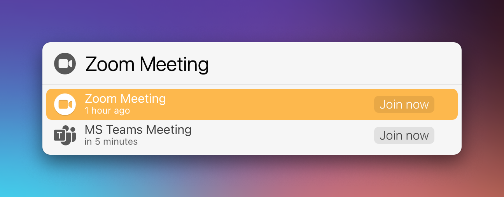

# LaunchBar Action: Join Meeting

This action checks your recent events for links to Zoom or Microsoft Teams, events that started within the last two hours or will start in the next 30 minutes.

Press `enter` to join a selected meeting. If there is only one meeting, it will be launched directly.

## Installation & Requirements (IMPORTANT!)

Unfortunately, in order to run smoothly, actions written in Swift need to be both "unquarantined" and compiled. I made [a dedicated action that does both](https://github.com/Ptujec/LaunchBar/tree/master/Compile-Swift-Action#readme). Run the `.lbaction` bundle of this action through the compile action before you start using it.

This action also requires **full calendar access**. You will be prompted for it. You can also get to the respective privacy settings when you hit `enter` on the alert message in the LaunchBar interface.

Let me know if you need help. 

## Download & Update

[Click here](https://github.com/Ptujec/LaunchBar/archive/refs/heads/master.zip) to download this LaunchBar action along with all the others. Or simply use [LaunchBar Repo Updates](https://github.com/Ptujec/LaunchBar/tree/master/LB-Repo-Updates#launchbar-repo-updates-action)! It helps automate updating existing and installing new actions.