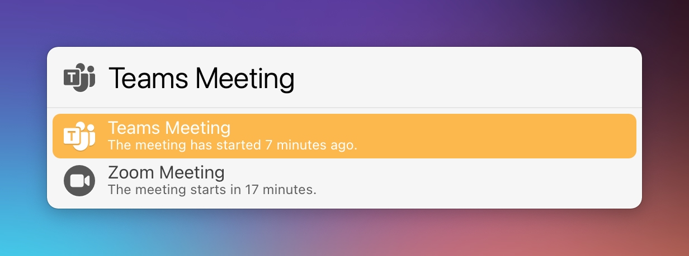

# LaunchBar Action: Join Meeting

This action checks your 10 recent events for links to Zoom or Microsoft Teams. If the event started within the last hour or will start in the next 20 minutes you will be automatically connected. If there are more than one meeting you can pick which one you want to join.

## Installation 

This action depends on a Shortcut named "[Get current events](https://www.icloud.com/shortcuts/05f9af8ded344f579d36776bcf44bc3d)". You need to install it in order for the action to work. You will be prompted on first run to do so.

## Download
[Download LaunchBar Action: Join Meeting](https://minhaskamal.github.io/DownGit/#/home?url=https://github.com/Ptujec/LaunchBar/tree/master/Join-Meeting) (powered by [DownGit](https://github.com/MinhasKamal/DownGit))

## Updates

The latest version of this action integrates with Action Updates by @prenagha. You can find the [latest version in his Github repository](https://github.com/prenagha/launchbar). For more information and a signed version of Action Updates [visit his website](https://renaghan.com/launchbar/action-updates/).