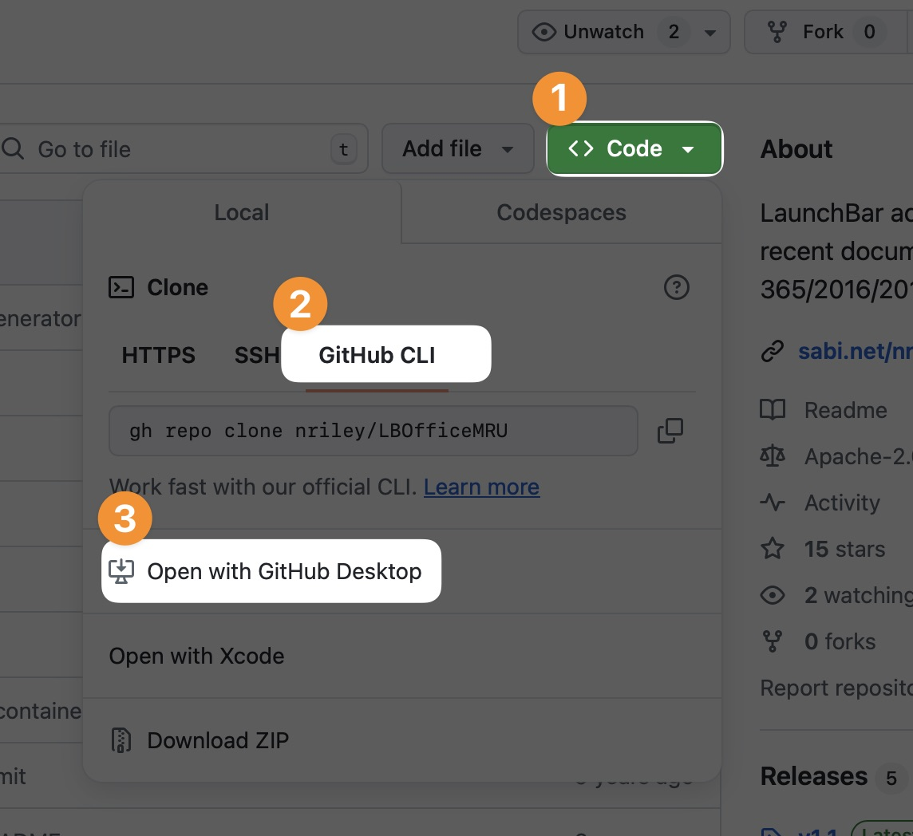

# LaunchBar Repo Updates Action

This action completes the idea behind my [Local Action Updates](https://github.com/Ptujec/LaunchBar/tree/master/Local-Action-Updates) action.

## Main Flow

**Action 1: LaunchBar Repo Updates**

1) Checks and updates included repositories.

2) If a repo has new or updated LaunchBar actions, it automatically runs …

**Action 2: Local Action Updates**

3) Compares actions within repos included in Action 1 with your installed actions locally.

4) Offers to update installed actions if a newer version is available.

5) Sends a comprehensive report of updated, new, installed, and not installed actions.

## What is a Repo?

A repository (short repo) is something like a folder. It lives on the web (usually on GitHub.com) and has a local representation on your Mac if you clone it.

## Adding Repositories Locally

If you are new to Git and GitHub, I recommend using [GitHub Desktop](https://github.com/apps/desktop). This should make adding repos locally (cloning) easier.

It is pretty straightforward. On the main repo page …

1) Click the green `Code` button

2) If not selected, click `GitHub CLI`

3) Click `Open with GitHub Desktop` and follow the instructions.

**Note:** Don't be surprised if you don't see any updates, because after the initial setup, everything should be already up to date. In this case, you can run **Local Action Updates** manually and select the newly created local repo.

## Required/Recommended

1) [Git](https://dev.to/milu_franz/git-explained-the-basics-igc), which is part of **Apple's Command Line Tools**. If you don't have Apple's Command Line Tools installed, you need to install them. It seems [best to do that manually at the moment](https://github.com/orgs/Homebrew/discussions/5723#discussioncomment-11185411).

2) [GitHub account](https://github.com/signup). This is actually not really required, but recommended since [most LaunchBar repositories exist on GitHub](https://github.com/topics/launchbar?o=desc&s=updated). This action also works with [Codeberg](https://codeberg.org/Ptujec/LaunchBar) … and probably GitLab. But I have not tested the latter.

## Testing

Testing is a bit tricky; usually, you are done after one go. For that purpose, I created a [Test Repo](https://github.com/Ptujec/LaunchBar-Test-Repo) to play with. Feel free to use it or create your own test repo.

## Download

[Click here](https://github.com/Ptujec/LaunchBar/archive/refs/heads/master.zip) to download this LaunchBar action along with all the others. Or [clone](https://docs.github.com/en/repositories/creating-and-managing-repositories/cloning-a-repository) this repository.

*[→ See a list of all my actions here.](https://ptujec.github.io/launchbar)*
