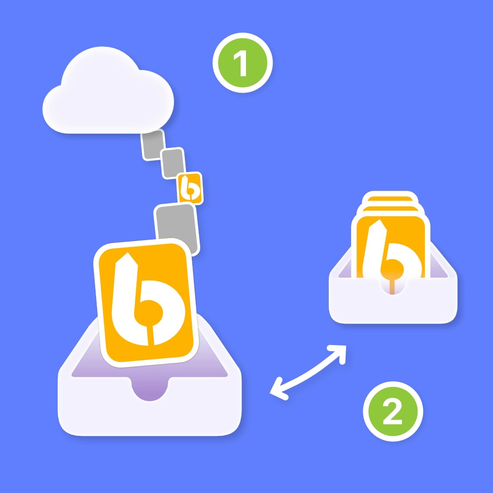

# LaunchBar Repo Updates Action

*[→ See a list of all my actions here.](https://ptujec.github.io/launchbar)* 

This action completes the idea behind my [Local Action Updates](https://github.com/Ptujec/LaunchBar/tree/master/Local-Action-Updates) action: a simple and fast way to update custom LaunchBar actions, that are shared in repositories like this one. 



## How It Works

Even though there are two actions involved, it is one simple and largely automatic flow:

**Action 1: LaunchBar Repo Updates:**

1) Checks and updates included repositories.

2) If a repository has new or updated LaunchBar actions, it automatically runs action 2.

**Action 2: Local Action Updates:**

3) Compares the actions in the repositories included in action 1 with your installed actions.

4) Offers to update installed actions if a newer version is available.

5) Sends a report of actions that are updated, new, installed, and not installed.

**NOTE:** Usually, the second action is triggered only when new or updated actions are detected. However, it will also run after you add a new repository. 

## What Is a Repo?

A repository (short repo) is something like a folder. It lives on the web and has a local representation on your Mac if you clone it. 

Most [repos with LaunchBar actions](https://github.com/topics/launchbar?o=desc&s=updated) are hosted on GitHub.

## Adding Repositories Locally (Cloning)

If you are new to Git, I recommend using [GitHub Desktop](https://github.com/apps/desktop). This should make adding repos locally ([cloning](https://docs.github.com/en/repositories/creating-and-managing-repositories/cloning-a-repository)) easier.

Platforms that host repositories should offer a URL that ends with `.git` somewhere on the main repository page. On GitHub, click the green `Code` button. On Codeberg, you can find it next to the blue `HTTP` button.

In GitHub Desktop then go to `File > Clone Repository…` and enter the URL. 

The URL for this repo is: 

```
https://github.com/Ptujec/LaunchBar.git. 
```

**NOTE:** Currently, the action only correctly handles repositories hosted on GitHub or Codeberg.

## Requirements

1) **[Git](https://git-scm.com)**. Check if it is installed with the terminal command `git -v`. If not, an easy solution is to install [GitHub Desktop](https://github.com/apps/desktop) as this will also install git in the process.

2) When detecting action changes in repos, this action tries to initiate the **[Local Action Updates](https://github.com/Ptujec/LaunchBar/tree/master/Local-Action-Updates)** action. So, you need to install that action as well.

## Download

[Click here](https://github.com/Ptujec/LaunchBar/archive/refs/heads/master.zip) to download this LaunchBar action along with all the others. However, the point of this action is that you don't have to do that manually for every new action or update.

## Support

If you like what I am doing, please spread the word. You can also **sponsor** my LaunchBar projects via [Buy me a coffee](https://www.buymeacoffee.com/ptujec) or [PayPal](https://www.paypal.com/donate/?business=J3RS8S74NDJPU&no_recurring=0&currency_code=EUR). Thanks! ♥️

<a href="https://www.buymeacoffee.com/ptujec" target="_blank"></a>
