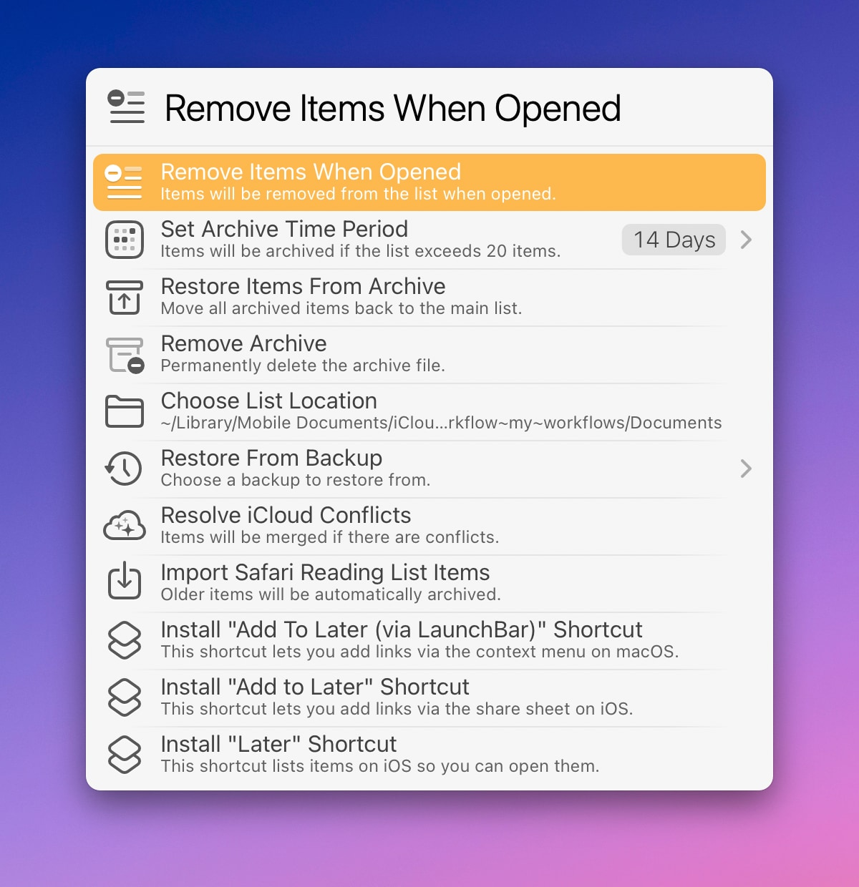

# LaunchBar Action: Later

*[→ See a list of all my actions here.](https://ptujec.github.io/launchbar)*

Maybe this sounds familiar: somehow, you ended up in the middle of a YouTube video — but you should be doing something else. That’s where this action comes in. Open the action in LaunchBar and press `Command` + `Enter`. Problem solved.

How? The action closes the active tab and saves its URL in a list for you to revisit later.

Obviously, you can save more than just YouTube videos. 

You can access the list at any time with `Space` or `Enter`. To remove items from the list, use `Command` + `Enter`, just as you did to add them.

## Additional Functionality

- You can also add items to the list by sending a URL to the action. Select the URL, press `Tab`, select the action, then press `Enter`.
- The action will add the **current time marker** to **YouTube** video URLs automatically. However, for this to work, you need to allow JavaScript for Apple Events. This is turned off by default. To turn it on in Safari, go to `Settings` ‣ `Developer` ‣ `Automation`. In Chromium browsers, you can find the option in the `View` ‣ `Developer` menu. Otherwise, the URL will still be saved, but without the time marker.
- Paste a link in the text field with `Shift` + `Enter`.
- Hold `Option` in addition to `Command` to prevent closing the current tab while saving a link.

## Settings

There are some settings that can further tailor the action to your liking. You can get to them with `Control` + `Enter`.

### Open Behavior

By default, items are removed from the list when you open them. You can change that with a simple toggle.

**Note**: If an item is opened and removed, it won't automatically disappear from LaunchBar's interface. To see the updated list, run the action again.

### Archive Behavior

Items will be moved to an archive list after 14 days by default. You can change that as well.

Options to restore items from the archive or to delete the archive will show up in settings once there is an archive.

To view archived items hold `Option` when running the action.

### Restore From Backup

The action automatically creates a backup when adding or removing items. It will keep the latest 10 backups. So there should always be a way to recover your data if something goes wrong.

### List Location

You can choose another location for the list (`later.json`) to be stored in.

### Resolve iCloud Conflict

If the list is stored in iCloud Drive (which is the default), you can access it from multiple devices. However, syncing may not always work as expected. If items appear to be missing from the list, using this option might help. This section is written in Swift and may require [compilation](https://github.com/Ptujec/LaunchBar/tree/master/Compile-Swift-Action).

### Safari Reading List Import

Import items from Safari Reading List. 

*Originally, the idea was to base the whole action on Safari Reading List. But unfortunately, without a proper API, it is impossible to make this work reliably. (If you have a workaround that also allows removing items without messing up syncing, let me know.)*

### Install Companion Shortcuts

This action is made with macOS in mind. However, there are two companion shortcuts you can use on iOS. One is for [adding items to the list](https://www.icloud.com/shortcuts/9a64a6c48e4d4ad7aa7cfee0694c36a9). The other [displays the list](https://www.icloud.com/shortcuts/cedf5b879dd94cdd8b142d9e09585388).

**Note**: This requires the default list location.

## Download & Update

[Click here](https://github.com/Ptujec/LaunchBar/archive/refs/heads/master.zip) to download this LaunchBar action along with all the others. Or simply use [LaunchBar Repo Updates](https://github.com/Ptujec/LaunchBar/tree/master/LB-Repo-Updates#launchbar-repo-updates-action)! It helps automate updating existing and installing new actions.
