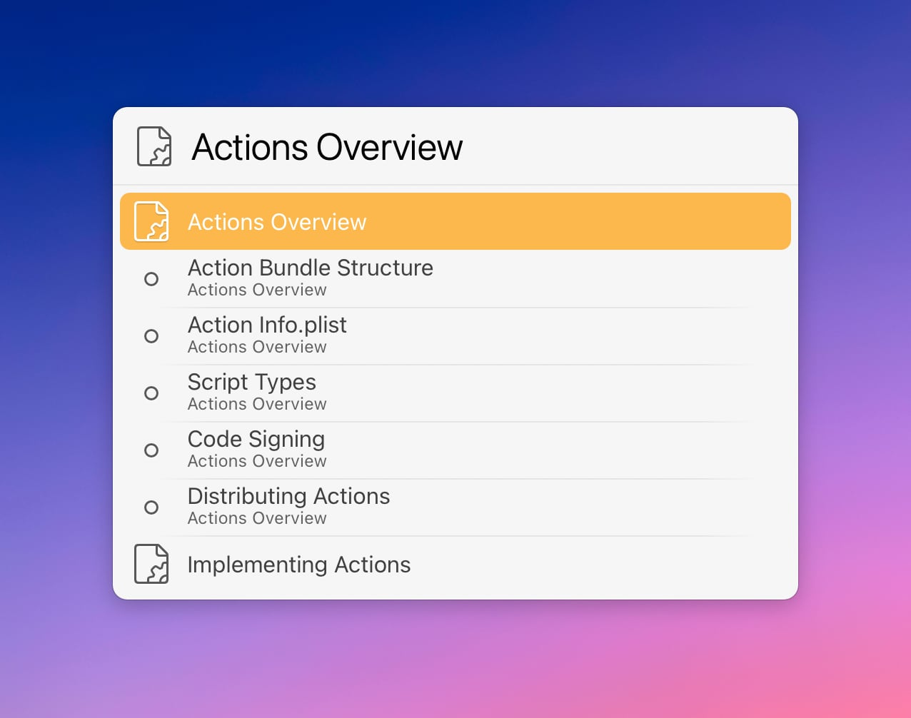

# LaunchBar Action: LaunchBar Developer Documentation

This action gives quick access to sections in the [LaunchBar Developer Documentation](https://developer.obdev.at/resources/documentation/launchbar-developer-documentation/#/welcome).

Hold <kbd>Command</kbd> to refresh the data. It typically does not change often, which is why we don't load the page data every time.

## Download & Update

[Click here](https://github.com/Ptujec/LaunchBar/archive/refs/heads/master.zip) to download this LaunchBar action along with all the others. Or simply use [LaunchBar Repo Updates](https://github.com/Ptujec/LaunchBar/tree/master/LB-Repo-Updates#launchbar-repo-updates-action)! It helps automate updating existing and installing new actions.