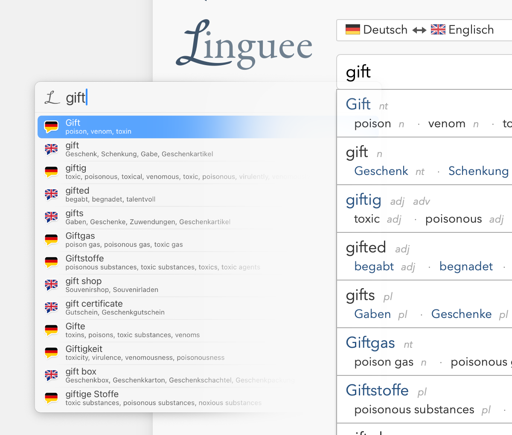
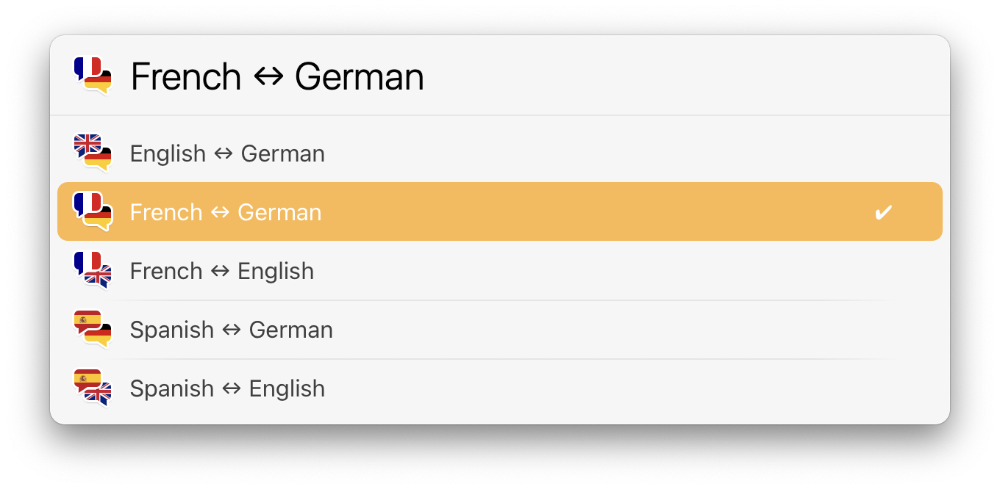
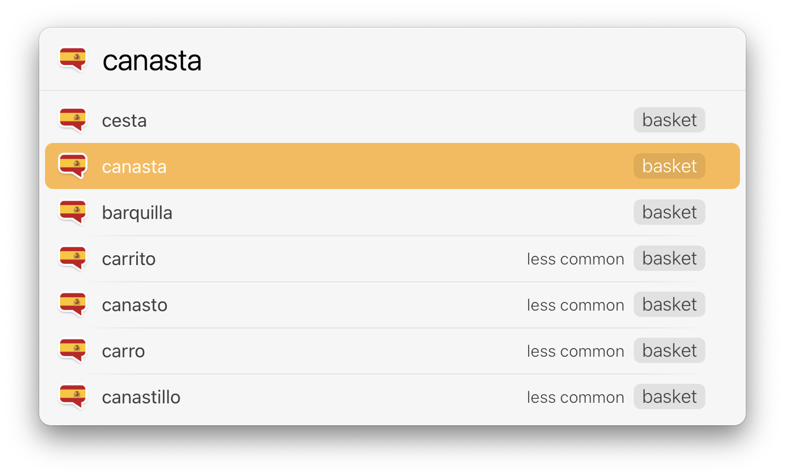

# LaunchBar Action: Linguee

 

This action lets you use linguee.com with LaunchBar. 

Set your preferred language combination with ⏎. Supported languages are German, English, French, Spanish, Portuguese and Russian (No political statement. Slava Ukraini!). 

 

Enter the word you want to translate with ␣ (space bar). You should see suggestions as you type, including some translation items for each suggestion.

 

Show all translation results with ⏎ … 

 

… or paste the selected word with ⇧⏎. Pasting works for both  suggestions and results. 

## Note

Linguee may block your IP address for 24 hours if you use this a lot. In this case you should still be able to see the preview items. But instead of the usual full translation details you only see the same translation items from preview again, when you hit return. This is indicated by a generic blue bubble icon instead of the bubble icon of the translated language. 
Should you see the generic blue bubble icon without being blocked please [create an issue here](https://github.com/Ptujec/LaunchBar/issues/new).

Website changes may break this action any time. 

Also, there are two more language actions in this repository (not counting the Slovene ones), **[DeepL](https://github.com/Ptujec/LaunchBar/tree/master/DeepL-Action#readme)** and **[Verbs](https://github.com/Ptujec/LaunchBar/tree/master/Verbs-Action#readme)**. 

## Download

[Download LaunchBar Action: Linguee](https://minhaskamal.github.io/DownGit/#/home?url=https://github.com/Ptujec/LaunchBar/tree/master/Linguee-Action) (powered by [DownGit](https://github.com/MinhasKamal/DownGit))

## Updates

This action integrates with Action Updates by @prenagha. You can find the [latest version in his Github repository](https://github.com/prenagha/launchbar). For more information and a signed version of Action Updates [visit his website](https://renaghan.com/launchbar/action-updates/).