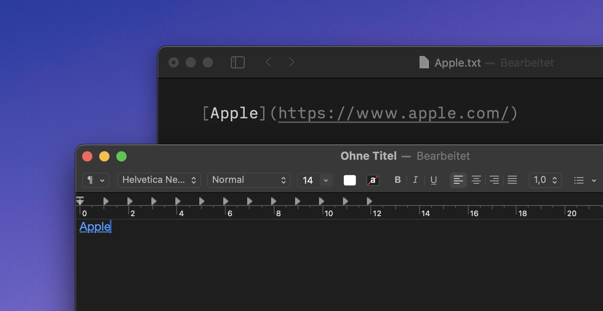

# LaunchBar Action: Link to Website

*[→ See a list of all my actions here.](https://ptujec.github.io/launchbar)* 

 

This action pastes the title and URL of the current website, formatted as **rich text** or **markdown**, depending on the text field you are using. 

By default, the action takes the website information from your default browser. If your default browser is not running, it will look for one of the other supported browsers (Safari, Chrome, Brave, Arc, Vivaldi). 

You can enter a **custom title** by holding down the space bar. If you hold down the `command` key, only the **plain link** will be inserted. 

If you hold down the `option` key you can add the **current time marker** to **YouTube** and **Twitch** video URLs. However, for this to work, you need to allow JavaScript for Apple Events. This is turned off by default. To turn it on in Safari, go to `Settings` ‣ `Developer` ‣ `Automation`. In Chromium browsers, you can find the option in the `View` ‣ `Developer` menu. 

## Setup (IMPORTANT!)

**In order to run smoothly, actions written in Swift need to be both "un-quarantined" and compiled. I made [a dedicated action that does both](https://github.com/Ptujec/LaunchBar/tree/master/Compile-Swift-Action#readme). Run the `.lbaction` bundle of this action through the compile action before you start using it.**

## Download & Update

[Click here](https://github.com/Ptujec/LaunchBar/archive/refs/heads/master.zip) to download this LaunchBar action along with all the others. Or simply use [LaunchBar Repo Updates](https://github.com/Ptujec/LaunchBar/tree/master/LB-Repo-Updates#launchbar-repo-updates-action)! It helps automate updating existing and installing new actions.