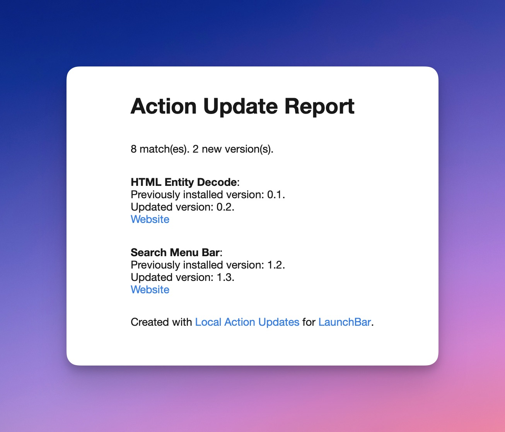

# LaunchBar Action: Local Action Updates

*[→ See a list of all my actions here.](https://ptujec.github.io/launchbar)*

Updating LaunchBar Actions is an unsolved problem. [Padraic built an action to make it a little easier](https://renaghan.com/launchbar/action-updates/). Most of my actions are compatible with his update action. But it can take quite some time if you have a lot of actions installed.

This new action takes a different approach. It is not ideal either. But it might be helpful in some cases. **The idea is to download (or clone) a whole Github repo of actions. Then this action compares the actions in the folder with your installed actions. If the version numbers don't match, the installed action will be replaced with the downloaded version.**
 
You can let the action replace all matching actions at once or decide individually.

If you use [my actions](https://ptujec.github.io/launchbar), I would recommend using this action every once in a while since I am trying to regularly improve my actions.

## Download

[Download LaunchBar Action: Local Action Updates](https://minhaskamal.github.io/DownGit/#/home?url=https://github.com/Ptujec/LaunchBar/tree/master/Local-Action-Updates) (powered by [DownGit](https://github.com/MinhasKamal/DownGit))