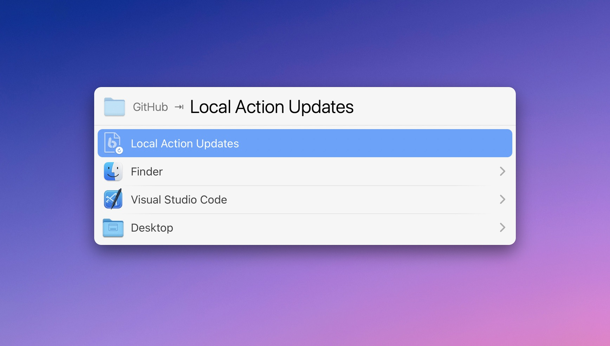

# LaunchBar Action: Local Action Updates

*[→ See a list of all my actions here.](https://ptujec.github.io/launchbar)*

## The Dilemma

Updating LaunchBar Actions is an unsolved problem. [Padraic built an action to check for new versions of your installed actions online](https://renaghan.com/launchbar/action-updates/). Most of my actions are compatible with his update action. It works well if you just have a few actions installed, but it can take quite some time if you have a lot of actions installed.

So I wrote an action with a slightly different approach. It is not the ideal solution one would wish for either, but it works quite well with actions that are managed like [mine](https://ptujec.github.io/launchbar). That is, a lot of actions are maintained in a single GitHub repository, which means it is easy to download or clone them all in one go.

## How This Action Works

The idea is to do the work locally after downloading (or cloning) a whole GitHub repo of actions … or even multiple repos. **This action searches all actions in a given directory for new versions of the actions you have installed and offers to update them.**

The downside of this approach is that you need to do the downloading manually or through an app like GitHub Desktop (which is still a manual process).

But there are also a couple of **advantages**: It is **faster**, especially if you have lots of actions installed. Installing new versions is very **simple**. The only requirement is that the new version has a [standard version number](https://en.wikipedia.org/wiki/Software_versioning#Semantic_versioning). Plus, this action also helps to **easily identify new actions** from the input source.

## Features

### 1) Batch or One-by-One

You can install the new versions either all at once or **decide individually**.

### 2) Automatic Unzip

If you select a zipped download (e.g., after [downloading this repository](https://github.com/Ptujec/LaunchBar/archive/refs/heads/master.zip)), the action will automatically unzip it and pick the unzipped folder as the input source.

### 3) Report

When done, you will get a report that not only lists the updated actions but also the ones you have not installed. Every time after the first use, it will show a separate section with only the **new actions since you checked last**. This way, you can make sure you don't miss out on new actions you might be interested in.

Right from the report, you can select the source or any of the Action Bundles you have not installed yet. This way, you can easily install new actions or browse their contents. 

This is also helpful for updated actions that are written in Swift. Select the bundle with a click, press `⇥`, and select "Compile Swift Action" to compile the updated action.

## Download

[Click here](https://github.com/Ptujec/LaunchBar/archive/refs/heads/master.zip) to download this LaunchBar action along with all the others. Or [clone](https://docs.github.com/en/repositories/creating-and-managing-repositories/cloning-a-repository) this repository.