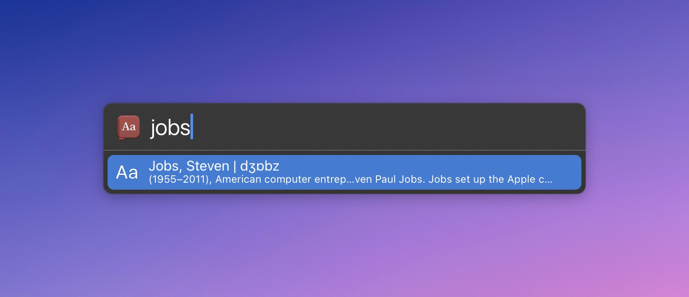

# LaunchBar Action: Look Up in Dictionary

This action is an attempt to recreate some of what [this action](https://github.com/nbjahan/launchbar-livedic) did when it was still working.

Unfortunately, the [official API](https://developer.apple.com/documentation/coreservices/1446842-dcscopytextdefinition) doesn't offer much else than all the info in one long string of text.

I guess it is better than nothing. But in all honesty, it might be easier to just use the [trackpad gesture](https://support.apple.com/de-de/guide/mac-help/mchl3983326c/mac). There is also a service that is associated with the app by default. It won't give you a preview, but it works fine to enter a query.

If you still want to use this, read on.

## Installation (IMPORTANT!)

Unfortunately, in order to run smoothly, actions written in Swift need to be both "unquarantined" and compiled. I made [a dedicated action that does both](https://github.com/Ptujec/LaunchBar/tree/master/Compile-Swift-Action#readme). Run the `.lbaction` bundle of this action through the compile action before you start using it.

Let me know if you need help. 

## Download
[Click here](https://github.com/Ptujec/LaunchBar/archive/refs/heads/master.zip) to download this LaunchBar action along with all the others. Or [clone](https://docs.github.com/en/repositories/creating-and-managing-repositories/cloning-a-repository) this repository.

## Updates

Use [Local Action Updates](https://github.com/Ptujec/LaunchBar/tree/master/Local-Action-Updates#launchbar-action-local-action-updates) to keep track of new versions of all my actions and discover new ones at the same time. 

This action also supports [Action Updates](https://renaghan.com/launchbar/action-updates/) by Padraic Renaghan.