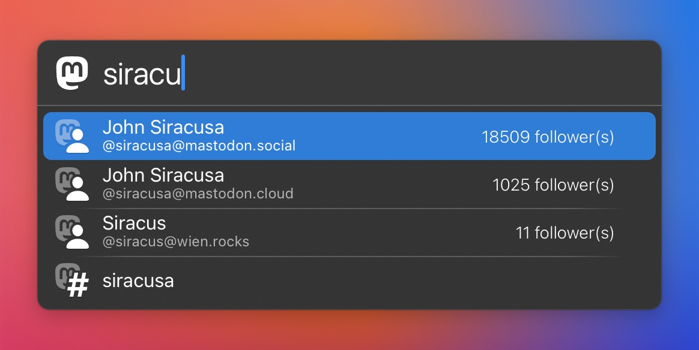

# LaunchBar Action: Mastodon Search 

 

Search Mastodon accounts and hashtags easily with LaunchBar. 

On first run you will have to choose your Mastodon instance. You can change your preferred Mastodon instance any time with `⇧↩`.

**1) Accounts**

If you hit return `↩` on a selected account it will open the account on the Mastodon instance you entered on the first run (assuming that is where you are signed in). Use `⌘↩` to open the account page on it's own home instance. Or `⌥↩` to copy the userhandle to your clipboard.

**2) Hashtags**

Hashtags open per default on your home instance. Use `⌘↩` to view results on mastodon.social (which usually has a lot more).

*[→ See a list of all my actions here.](https://ptujec.github.io/launchbar)* 

## Download

[Download LaunchBar Action: Mastodon Search](https://minhaskamal.github.io/DownGit/#/home?url=https://github.com/Ptujec/LaunchBar/tree/master/Mastodon) (powered by [DownGit](https://github.com/MinhasKamal/DownGit))

## Updates

This action integrates with Action Updates by @prenagha. You can find the [latest version in his Github repository](https://github.com/prenagha/launchbar). For more information and a signed version of Action Updates [visit his website](https://renaghan.com/launchbar/action-updates/).