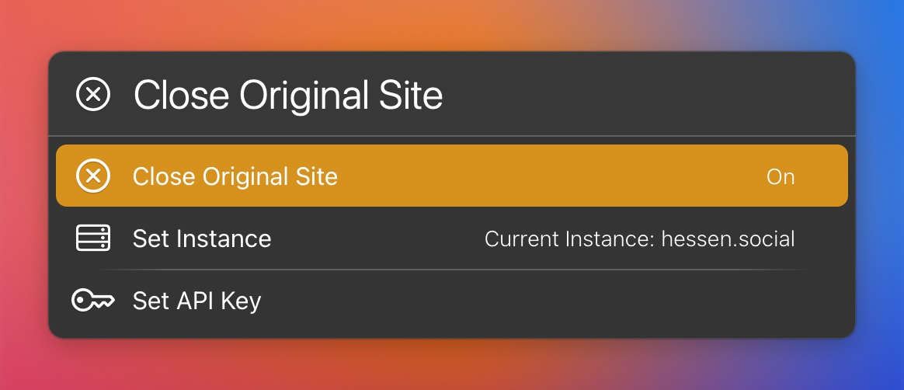
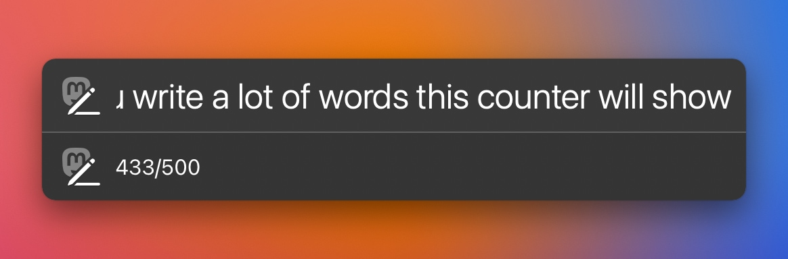
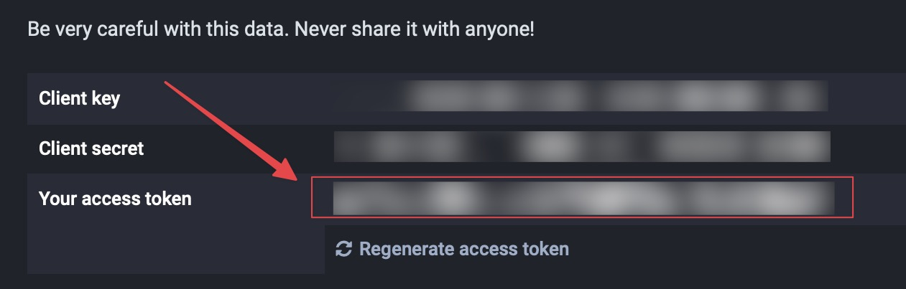

# LaunchBar Actions for Mastodon

*[→ See a list of all my actions here.](https://ptujec.github.io/launchbar)* 

## 1) Search Action

 

Search Mastodon accounts and hashtags easily with LaunchBar. 

On first run you will have to choose your preferred Mastodon instance (the one, you are signed in). You can change your preferred Mastodon instance any time with `⇧↩`.

### Accounts

If you hit return `↩` on a selected account it will open the account on your preferred Mastodon instance. Use `⌘↩` to open the account on it's original page. 

You can **follow** a selected account right from LaunchBar with `⌥↩`. This requires a (free) **[API-Token](#api-token)**. 

### Hashtags

Hashtags open per default on mastodon.social, which usually has a lot more results. Use `⌘↩` to view results on your home instance.

You can **follow** a selected hashtag right from LaunchBar with `⌥↩`.  This requires an [API-Token](#api-token).

## 2) Home Action

 

This action opens the current post or profile in Safari on your home instance. It is inspired by Jeff Johnsons [Homecoming Safari extension](https://underpassapp.com/news/2023-1-19homecoming.html) and [Federico Viticcis shortcut](https://www.macstories.net/ios/masto-redirect-a-mastodon-shortcut-to-redirect-profiles-and-posts-to-your-own-instance/). 

There are a couple of settings, that you can access with `⇧↩`:

 

**Note**: In order to redirect posts, you will need to create an [API-Token](#api-token).

## 3) Post Action (Toot)

This is a simple action to post a status (toot) on Mastodon. If you type a lot a counter will show …

 

You can use `⌘↩` to view your timeline after a successful post.

**Note**: This action requires an [API-Token](#api-token).

## API-Token 

Go to "https//:`your.server`/settings/applications/". If you came here from the dialog in the action that link should have opened automatically along with this one. 
Then click the `New application` button. 

You need the following permissions:

- Search: `follow`
- Home: `read: search`
- Post: `write:statuses`

You can leave everything else unchecked. Click `Submit`. After that you just need to copy the access token from your newly created "Application".  

 

If you change permissions in an existing application you need to regenerate the token for the new permissions to take effect.

## Download

[Download LaunchBar Actions for Mastodon](https://minhaskamal.github.io/DownGit/#/home?url=https://github.com/Ptujec/LaunchBar/tree/master/Mastodon) (powered by [DownGit](https://github.com/MinhasKamal/DownGit))

## Updates

This action integrates with Action Updates by @prenagha. You can find the [latest version in his Github repository](https://github.com/prenagha/launchbar). For more information and a signed version of Action Updates [visit his website](https://renaghan.com/launchbar/action-updates/).

