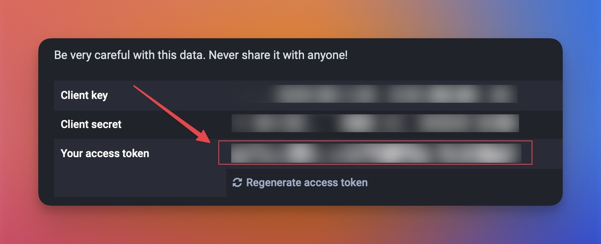

# LaunchBar Actions for Mastodon

*[→ See a list of all my actions here.](https://ptujec.github.io/launchbar)* 

## 1) Search Action

 

Search Mastodon accounts and hashtags easily with LaunchBar. 

On first run you will have to choose your Mastodon instance. You can change your preferred Mastodon instance any time with `⇧↩`.

### Accounts

If you hit return `↩` on a selected account it will open the account on the Mastodon instance you entered on the first run (assuming that is where you are signed in). Use `⌘↩` to open the account page on it's own home instance. Or `⌥↩` to copy the userhandle to your clipboard.

### Hashtags

Hashtags open per default on your home instance. Use `⌘↩` to view results on mastodon.social (which usually has a lot more).

## 2) Home Action

 

This action opens the current post or profile in Safari on your home instance. It is inspired by Jeff Johnsons [Homecoming Safari extension](https://underpassapp.com/news/2023-1-19homecoming.html) and [Federico Viticcis shortcut](https://www.macstories.net/ios/masto-redirect-a-mastodon-shortcut-to-redirect-profiles-and-posts-to-your-own-instance/). 

There are a couple of settings, that you can access with `⇧↩`:

 

**Note**: In order to redirect posts, you will need to create an API-Token. Go to "https//:`your server`/settings/applications/". Click the `New application` button. The only requirement for this action is `read: search`. You can leave everything else unchecked. Click `Submit`. After that you need just need to copy the access token from your newly created "Application".

 

## 3) Post Action (Toot)

This is a simple action to post a status (toot) on Mastodon. If you type a lot a counter will show …

 

**Note**: This action requires an API-Token. See 2) for how to create an API-Token. For this action you need to check `write:statuses`. (If you use the same application as above you need to regenerate the token for the new permissions to take effect.)

## Download

[Download LaunchBar Actions for Mastodon](https://minhaskamal.github.io/DownGit/#/home?url=https://github.com/Ptujec/LaunchBar/tree/master/Mastodon) (powered by [DownGit](https://github.com/MinhasKamal/DownGit))

## Updates

This action integrates with Action Updates by @prenagha. You can find the [latest version in his Github repository](https://github.com/prenagha/launchbar). For more information and a signed version of Action Updates [visit his website](https://renaghan.com/launchbar/action-updates/).

