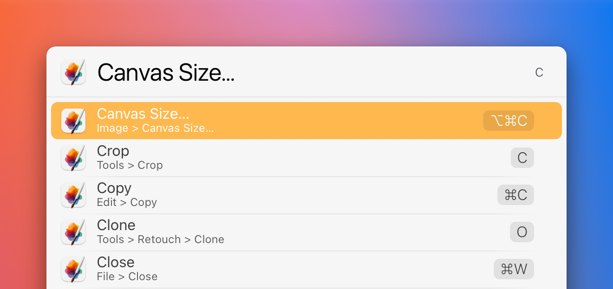

# LaunchBar Action: Menu Bar (powered by Finbar)

 

This action allows to trigger menu bar items right from within LaunchBar. **It requires [Finbar](https://www.roeybiran.com/apps/finbar), a wonderful application by Roey Biran**. 

The action will list all menu bar items of the frontmost application. You can then type to narrow down results. 

The main benefit of this approach is that it utilizes the superpower of LaunchBar. You’ll find stuff more easily without knowing the exact name. And LaunchBar learns and remembers your preferences. 

Let's say you want to export a PDF in Pages. You type `P` to find `PDF …` more easily, select the item and hit enter. The next time you type `P` the PDF export item will be on top of the list.

In addition to that the action remembers the last used item per application. So if you want to trigger the same menu bar item again it's right on top of the list. 

**Note**: Version 1.0 excludes some menu bar items like e.g. "Apple", "Open recent" to avoid clutter. In an updated version the action will respect the rules you set up in Finbar.  

## Download

[Download LaunchBar Action: Menu Bar](https://minhaskamal.github.io/DownGit/#/home?url=https://github.com/Ptujec/LaunchBar/tree/master/Menu-Bar) (powered by [DownGit](https://github.com/MinhasKamal/DownGit))

## Updates

This action integrates with Action Updates by @prenagha. You can find the [latest version in his Github repository](https://github.com/prenagha/launchbar). For more information and a signed version of Action Updates [visit his website](https://renaghan.com/launchbar/action-updates/).