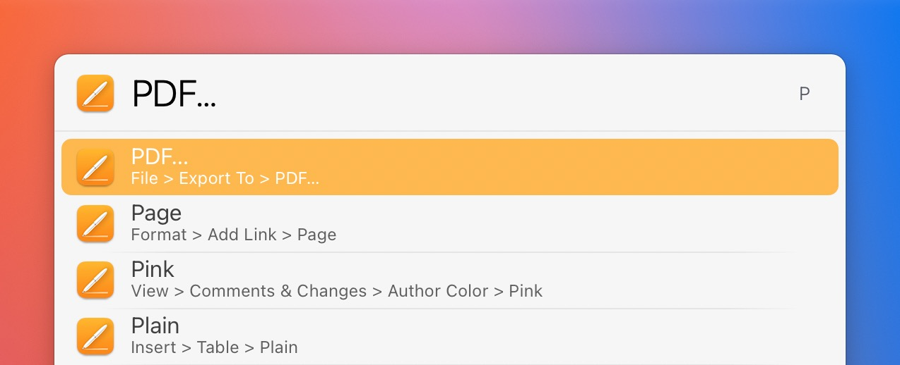

# LaunchBar Action: Menu Bar (powered by Finbar)

*[→ See a list of all my actions here.](https://ptujec.github.io/launchbar)* 

 

## Annoncement

**I created a new action that does the same thing, but it directly communicates with the "Application Services" API. It's called ["Menus"](https://github.com/Ptujec/LaunchBar/tree/master/Menus).**

## Description

This action allows to trigger [menu bar items](https://developer.apple.com/design/human-interface-guidelines/components/system-experiences/the-menu-bar) right from within LaunchBar. The action will list all menu bar items of the frontmost application. You can then type to narrow down results. 

**The main benefit of this approach is that it utilizes the superpower of LaunchBar. You’ll find stuff more easily without knowing the exact name. And LaunchBar learns and remembers your preferences.**

Let's say you want to export a PDF in Pages. You type `P` to find `PDF …` more easily, select the item and hit enter. The next time you type `P` the PDF export item will be on top of the list.

In addition to that the action remembers the last used item per application. So if you want to trigger the same menu bar item again it's right on top of the list. 

## Requirements

This action requires [Finbar](https://www.roeybiran.com/apps/finbar), a wonderful application by Roey Biran.

## Download & Update

[Click here](https://github.com/Ptujec/LaunchBar/archive/refs/heads/master.zip) to download this LaunchBar action along with all the others. Or simply use [LaunchBar Repo Updates](https://github.com/Ptujec/LaunchBar/tree/master/LB-Repo-Updates#launchbar-repo-updates-action)! It helps automate updating existing and installing new actions.
